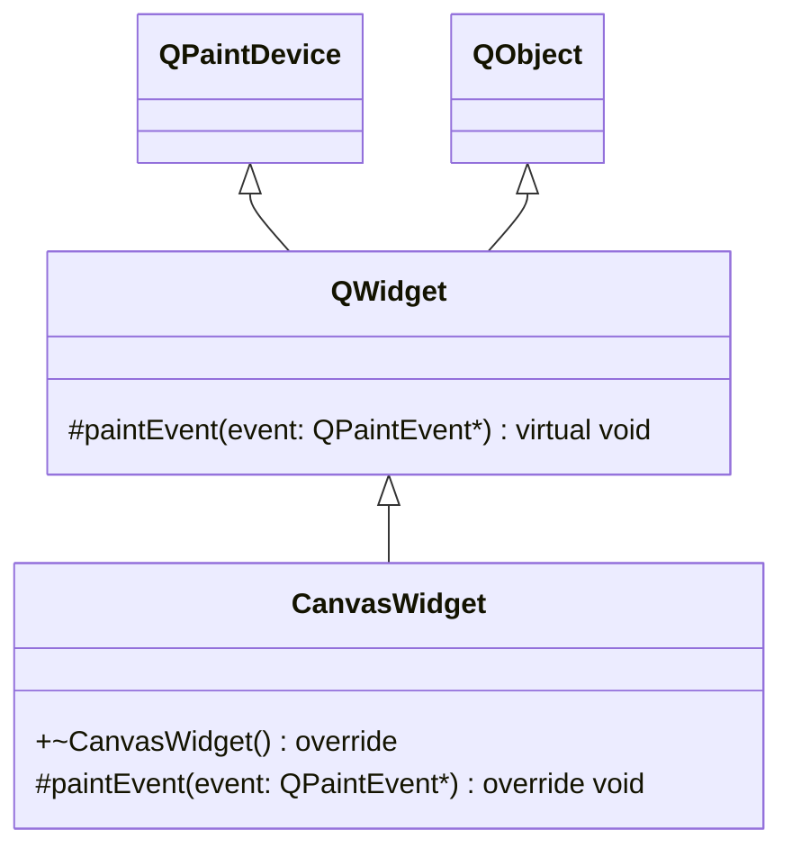
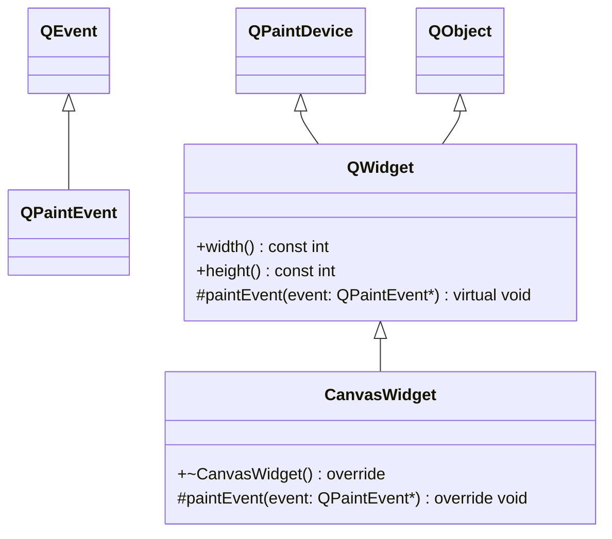
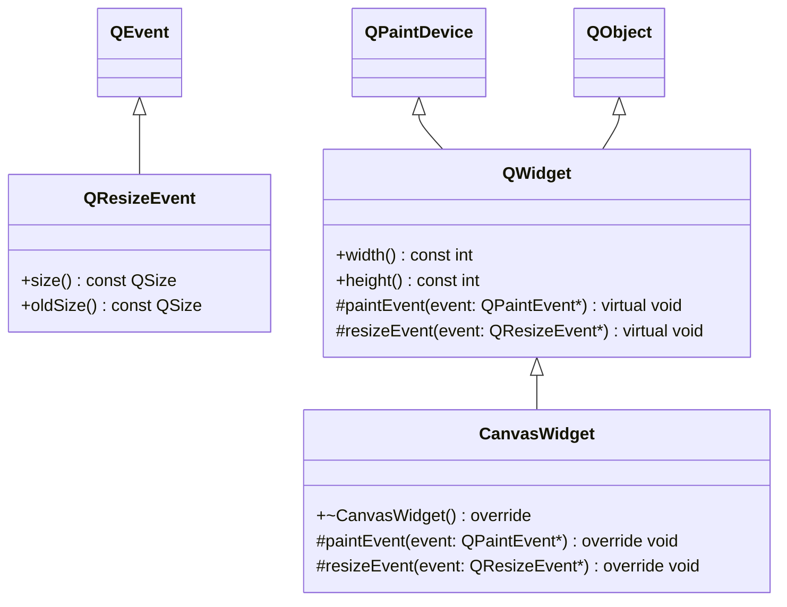

# List of Projects

## qPainter_001

- [qPainter_001](../qPainter_001)
- **Brief:** The simplest starting point for QPainter: initializing the painter pipeline on a custom QWidget via paintEvent() and drawing a diagonal vector line.

**Topics:**
- Overriding [QWidget::paintEvent(QPaintEvent*)](https://doc.qt.io/qt-6.8/qwidget.html#paintEvent)
- RAII painter initialization: [QPainter::QPainter(QPaintDevice*)](https://doc.qt.io/qt-6.8/qpainter.html#QPainter-1)
- Checking painter status: [QPainter::isActive()](https://doc.qt.io/qt-6.8/qpainter.html#isActive)
- Drawing basic lines: [QPainter::drawLine()](https://doc.qt.io/qt-6.8/qpainter.html#drawLine)

**Key Takeaway: The `paintEvent` Gateway**
- **The Only Place to Draw**: Any custom drawing using `QPainter` **must** take place inside the overridden `QWidget::paintEvent(QPaintEvent*)` method (or a function called directly by it). Outside this method, the widget's drawing surface is locked.
- **Automatic Execution**: The Qt event loop automatically calls this method whenever the widget needs to be drawn on the screen (e.g., initial show, resize, or when uncovered). We do not call it manually.

**Key Takeaway: The `QPainter painter(this)` Initialization**

That line is the core of how you start drawing in Qt. Let's break down exactly what `QPainter painter(this);` is doing:
- **`QPainter`**: This is the Qt class that acts as your digital paintbrush. It holds all the functions for drawing lines, shapes, and text.
- **`painter`**: This is simply the name of the local variable (the object) we are creating.
- **`(this)`**: This is the most important part. By passing `this` to the constructor, you are telling the `QPainter` exactly what surface to draw on. In this context, `this` refers to the `CanvasWidget` itself. A `QWidget` is a type of `QPaintDevice`, which means it is a valid canvas.

- **RAII (Resource Acquisition Is Initialization)**: By creating `painter` as a local stack variable, we guarantee safe initialization and cleanup. The constructor automatically calls `begin(this)` to open the drawing pipeline, and the destructor automatically calls `end()` to flush the drawing and clean up when the function exits.
- **Polymorphism and `QPaintDevice`**: The constructor expects a `QPaintDevice*`. Because `QWidget` inherits from `QPaintDevice`, passing `this` is perfectly valid. This powerful inheritance design means the exact same `QPainter` commands can be used to draw on screens (`QWidget`), images (`QPixmap`), or even export to PDFs (`QPdfWriter`), as they are all `QPaintDevice`s.

**Key Takeaway: `painter.isActive()` and Deactivation**
- **Sanity Checking**: `isActive()` returns a boolean confirming whether the painter successfully locked onto the canvas and initialized. If you try to paint outside of `paintEvent`, this will return `false`, saving you from issuing drawing commands into the void.
- **Manual Deactivation**: You can manually deactivate a painter by calling `painter.end()`. This is useful if you need to temporarily unlock the canvas so another specialized painting class can take over. (Note: when using the RAII initialization, `end()` is called automatically for you when the object goes out of scope).

**Key Takeaway: The Unused `QPaintEvent` Parameter**
- **Signature Requirement**: We are completely ignoring the `QPaintEvent *event` parameter in our code. We must include it simply because C++ requires our function signature to perfectly match Qt's original `QWidget::paintEvent(QPaintEvent*)` in order to successfully override it.

 

---

## qPainter_002
- [qPainter_002](../qPainter_002)
- **Brief**: Drawing dynamically relative to the window size by querying `width()` and `height()` directly inside `paintEvent`, without explicitly overriding `resizeEvent`.

**Topics:**
- Widget dimensions: [QWidget::width()](https://doc.qt.io/qt-6.8/qwidget.html#width-prop) and [QWidget::height()](https://doc.qt.io/qt-6.8/qwidget.html#height-prop)

**Key Takeaway: Dynamic Drawing via Event Loop**
- **Automatic Repaints**: Qt's event loop automatically schedules a `paintEvent` whenever the widget is resized by the user or the OS. 
- **Real-time Querying**: Because `paintEvent` is called *after* the resize happens, querying `width()` and `height()` directly inside the `paintEvent` guarantees you are always drawing against the fresh, current dimensions of the window. You do not strictly *need* to override `resizeEvent` just to achieve scalable drawing!

**Key Takeaway: Overrides and Unused Parameters**
- **Function Overrides**: C++ requires that when we override a virtual function like `QWidget::paintEvent`, our signature must match exactly. 
- **Unused Parameters**: We are completely ignoring the `QPaintEvent *event` parameter in our code. We must include it simply to satisfy the override requirement. While unused now, it holds data (like `rect()` and `region()`) for future optimizations.

 

---

## qPainter_003
- [qPainter_003](../qPainter_003)
- **Brief**: Overriding `QWidget::resizeEvent(QResizeEvent*)` to intercept window size changes for logging, calculations, or optimization prior to the drawing phase.

**Topics:**
- Event Interception: [QWidget::resizeEvent(QResizeEvent*)](https://doc.qt.io/qt-6.8/qwidget.html#resizeEvent)
- Event Data Payload: [QResizeEvent::size()](https://doc.qt.io/qt-6.8/qresizeevent.html#size)
- Base Class Delegation: `QWidget::resizeEvent(event)`

**Key Takeaway: The Event Lifecycle**
- **Interception Point**: By overriding `resizeEvent`, we can hook into the exact moment the operating system dictates a size change, *before* the painting phase happens. This is critical for complex engines (like TikZ) where heavy mathematics or layout recalculations should be cached here rather than recalculated 60 times a second inside `paintEvent`.
- **Event Payload (`QResizeEvent`)**: Unlike `paintEvent` where we ignored the parameter, `QResizeEvent` carries highly useful payload data, specifically `event->size()`, which tells us exactly what the new dimensions are going to be.
- **Base Class Delegation**: It is a critical Qt best practice to pass the event back up the chain by calling `QWidget::resizeEvent(event);` at the end of our override. This ensures that the underlying engine still handles its own internal housekeeping.

**FAQ: Why separate math from painting?**
- **Q:** *If `paintEvent` fires rapidly during a resize anyway, why bother moving the heavy math to `resizeEvent`?*
- **A:** During an active window drag, both events do indeed fire rapidly on a loop. However, the massive performance savings happen *when you are not resizing the window*. The OS fires `paintEvent` for dozens of non-resize reasons (e.g., hovering, animating, uncovering the window from behind another app, Alt-Tabbing). In all of these non-resize scenarios, `paintEvent` fires, but `resizeEvent` NEVER fires. By caching heavy math in `resizeEvent`, your app skips all calculations when the window is simply uncovered or hovered over, allowing `paintEvent` to instantly redraw the cached geometry without stuttering.

 