# List of Projects

## qPainter_001

- [qPainter_001](../qPainter_001)
- **Brief:** The simplest starting point for QPainter: initializing the painter pipeline on a custom QWidget via paintEvent() and drawing a diagonal vector line.

**Topics:**
- Overriding [QWidget::paintEvent(QPaintEvent*)](https://doc.qt.io/qt-6.8/qwidget.html#paintEvent)
- RAII painter initialization: [QPainter::QPainter(QPaintDevice*)](https://doc.qt.io/qt-6.8/qpainter.html#QPainter-1)
- Checking painter status: [QPainter::isActive()](https://doc.qt.io/qt-6.8/qpainter.html#isActive)
- Drawing basic lines: [QPainter::drawLine()](https://doc.qt.io/qt-6.8/qpainter.html#drawLine)

**Key Takeaway: The `paintEvent` Gateway**
- **The Only Place to Draw**: Any custom drawing using `QPainter` **must** take place inside the overridden `QWidget::paintEvent(QPaintEvent*)` method (or a function called directly by it). Outside this method, the widget's drawing surface is locked.
- **Automatic Execution**: The Qt event loop automatically calls this method whenever the widget needs to be drawn on the screen (e.g., initial show, resize, or when uncovered). We do not call it manually.

**Key Takeaway: The `QPainter painter(this)` Initialization**

That line is the core of how you start drawing in Qt. Let's break down exactly what `QPainter painter(this);` is doing:
- **`QPainter`**: This is the Qt class that acts as your digital paintbrush. It holds all the functions for drawing lines, shapes, and text.
- **`painter`**: This is simply the name of the local variable (the object) we are creating.
- **`(this)`**: This is the most important part. By passing `this` to the constructor, you are telling the `QPainter` exactly what surface to draw on. In this context, `this` refers to the `CanvasWidget` itself. A `QWidget` is a type of `QPaintDevice`, which means it is a valid canvas.

- **RAII (Resource Acquisition Is Initialization)**: By creating `painter` as a local stack variable, we guarantee safe initialization and cleanup. The constructor automatically calls `begin(this)` to open the drawing pipeline, and the destructor automatically calls `end()` to flush the drawing and clean up when the function exits.
- **Polymorphism and `QPaintDevice`**: The constructor expects a `QPaintDevice*`. Because `QWidget` inherits from `QPaintDevice`, passing `this` is perfectly valid. This powerful inheritance design means the exact same `QPainter` commands can be used to draw on screens (`QWidget`), images (`QPixmap`), or even export to PDFs (`QPdfWriter`), as they are all `QPaintDevice`s.

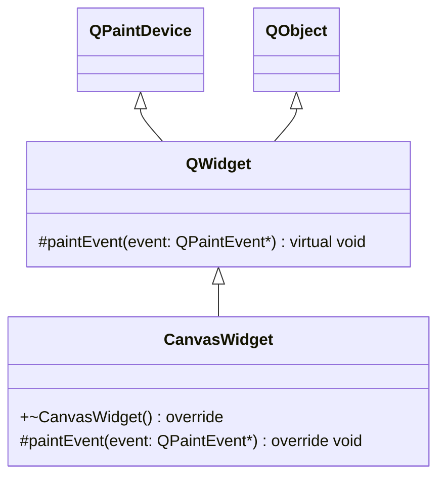
```mermaid
classDiagram
    QPaintDevice <|-- QWidget
    QObject <|-- QWidget
    QWidget <|-- CanvasWidget
    
    class QWidget {
        #paintEvent(event: QPaintEvent*) virtual void
    }
    
    class CanvasWidget {
        +~CanvasWidget() override
        #paintEvent(event: QPaintEvent*) override void
    }
```

**Key Takeaway: `painter.isActive()` and Deactivation**
- **Sanity Checking**: `isActive()` returns a boolean confirming whether the painter successfully locked onto the canvas and initialized. If you try to paint outside of `paintEvent`, this will return `false`, saving you from issuing drawing commands into the void.
- **Manual Deactivation**: You can manually deactivate a painter by calling `painter.end()`. This is useful if you need to temporarily unlock the canvas so another specialized painting class can take over. (Note: when using the RAII initialization, `end()` is called automatically for you when the object goes out of scope).

**Key Takeaway: The Unused `QPaintEvent` Parameter**
- **Signature Requirement**: We are completely ignoring the `QPaintEvent *event` parameter in our code. We must include it simply because C++ requires our function signature to perfectly match Qt's original `QWidget::paintEvent(QPaintEvent*)` in order to successfully override it.

 

---

## qPainter_002
- [qPainter_002](../qPainter_002)
- **Brief**: Drawing dynamically relative to the window size by querying `width()` and `height()` directly inside `paintEvent`, without explicitly overriding `resizeEvent`.

**Topics:**
- Widget dimensions: [QWidget::width()](https://doc.qt.io/qt-6.8/qwidget.html#width-prop) and [QWidget::height()](https://doc.qt.io/qt-6.8/qwidget.html#height-prop)

**Key Takeaway: Dynamic Drawing via Event Loop**
- **Automatic Repaints**: Qt's event loop automatically schedules a `paintEvent` whenever the widget is resized by the user or the OS. 
- **Real-time Querying**: Because `paintEvent` is called *after* the resize happens, querying `width()` and `height()` directly inside the `paintEvent` guarantees you are always drawing against the fresh, current dimensions of the window. You do not strictly *need* to override `resizeEvent` just to achieve scalable drawing!

**Key Takeaway: Overrides and Unused Parameters**
- **Function Overrides**: C++ requires that when we override a virtual function like `QWidget::paintEvent`, our signature must match exactly. 
- **Unused Parameters**: We are completely ignoring the `QPaintEvent *event` parameter in our code. We must include it simply to satisfy the override requirement. While unused now, it holds data (like `rect()` and `region()`) for future optimizations.

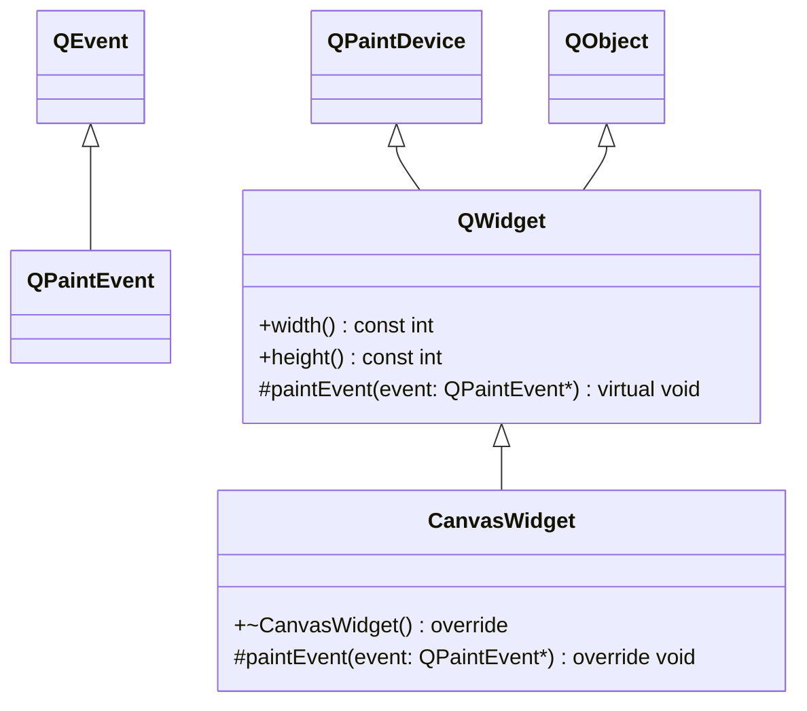
```mermaid
classDiagram
    QEvent <|-- QPaintEvent
    
    QPaintDevice <|-- QWidget
    QObject <|-- QWidget
    QWidget <|-- CanvasWidget
    
    class QWidget {
        +width() const int
        +height() const int
        #paintEvent(event: QPaintEvent*) virtual void
    }
    
    class CanvasWidget {
        +~CanvasWidget() override
        #paintEvent(event: QPaintEvent*) override void
    }
```

 

---

## qPainter_003
- [qPainter_003](../qPainter_003)
- **Brief**: Overriding `QWidget::resizeEvent(QResizeEvent*)` to intercept window size changes for logging, calculations, or optimization prior to the drawing phase.

**Topics:**
- Event Interception: [QWidget::resizeEvent(QResizeEvent*)](https://doc.qt.io/qt-6.8/qwidget.html#resizeEvent)
- Event Data Payload: [QResizeEvent::size()](https://doc.qt.io/qt-6.8/qresizeevent.html#size)
- Base Class Delegation: `QWidget::resizeEvent(event)`

**Key Takeaway: The Event Lifecycle**
- **Interception Point**: By overriding `resizeEvent`, we can hook into the exact moment the operating system dictates a size change, *before* the painting phase happens. This is critical for complex engines (like TikZ) where heavy mathematics or layout recalculations should be cached here rather than recalculated 60 times a second inside `paintEvent`.
- **Event Payload (`QResizeEvent`)**: Unlike `paintEvent` where we ignored the parameter, `QResizeEvent` carries highly useful payload data, specifically `event->size()`, which tells us exactly what the new dimensions are going to be.
- **Base Class Delegation**: It is a critical Qt best practice to pass the event back up the chain by calling `QWidget::resizeEvent(event);` at the end of our override. This ensures that the underlying engine still handles its own internal housekeeping.

**FAQ: Why separate math from painting?**
- **Q:** *If `paintEvent` fires rapidly during a resize anyway, why bother moving the heavy math to `resizeEvent`?*
- **A:** During an active window drag, both events do indeed fire rapidly on a loop. However, the massive performance savings happen *when you are not resizing the window*. The OS fires `paintEvent` for dozens of non-resize reasons (e.g., hovering, animating, uncovering the window from behind another app, Alt-Tabbing). In all of these non-resize scenarios, `paintEvent` fires, but `resizeEvent` NEVER fires. By caching heavy math in `resizeEvent`, your app skips all calculations when the window is simply uncovered or hovered over, allowing `paintEvent` to instantly redraw the cached geometry without stuttering.

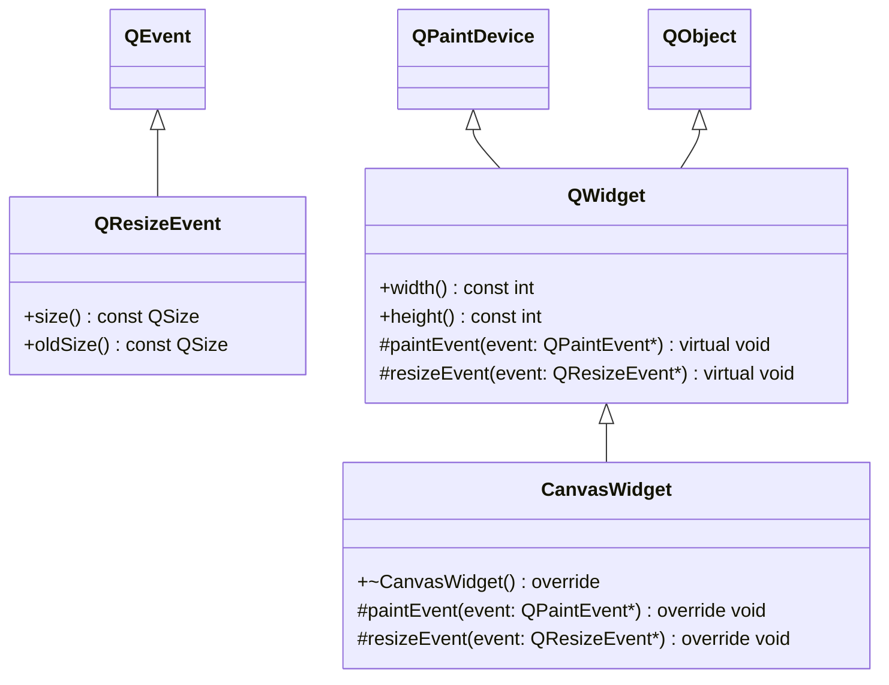
```mermaid
classDiagram
    QEvent <|-- QResizeEvent
    
    class QResizeEvent {
        +size() const QSize
        +oldSize() const QSize
    }
    
    QPaintDevice <|-- QWidget
    QObject <|-- QWidget
    QWidget <|-- CanvasWidget
    
    class QWidget {
        +width() const int
        +height() const int
        #paintEvent(event: QPaintEvent*) virtual void
        #resizeEvent(event: QResizeEvent*) virtual void
    }
    
    class CanvasWidget {
        +~CanvasWidget() override
        #paintEvent(event: QPaintEvent*) override void
        #resizeEvent(event: QResizeEvent*) override void
    }
```

 

---

## Architectural Note: The Holy Trinity of Qt Painting
Before we start modifying the state of our painter (changing colors and thickness), it is critical to understand the three core classes that allow Qt's graphics system to work identically across multiple platforms and formats:

1. **`QPainter` (The Artist)**: This is the class you interact with (e.g., `painter.drawLine()`). It holds the current settings (pen color, font, brush) and tells the system *what* to draw.
2. **`QPaintDevice` (The Canvas)**: This represents the physical surface you are drawing on. It is a 2D space with a width, height, and coordinate system. `QWidget`, `QPixmap`, `QImage`, and `QPdfWriter` all inherit from `QPaintDevice`.
   - *When will we use this?* Currently, our `QWidget` acts as the canvas. In **Day 6 (Advanced Graphics & Off-Screen Rendering)**, we will dynamically swap the canvas to a `QImage` to export PNGs, and a `QPdfWriter` to export PDFs.
3. **`QPaintEngine` (The Translator)**: This class is completely hidden from you. It sits between the Artist and the Canvas. If you draw on a `QWidget`, the internal engine translates your line into low-level OpenGL, Metal, or Direct2D commands. If you draw on a `QPdfWriter`, the PDF engine translates that exact same `drawLine()` command into a PDF vector string.
   - *When will we use this?* **Never.** Application developers treat this as a black box. It is exclusively touched by internal Qt engineers porting the framework to new hardware.

This separation of concerns is the secret sauce. It is why the exact same complex math from your TikZ engine can render perfectly to a 4K monitor, save to a PNG, or export to a PDF, without you having to write three different versions of your code!

---

## qPainter_004
- [qPainter_004](../qPainter_004)
- **Brief**: Managing the "Artist's" State Stack. Because `QPainter` is the only class in the Trinity that holds styling data, we must use `save()` and `restore()` to backup and reset its brain (Pens and Brushes) to prevent cross-contamination.

**Topics:**
- Push state: [QPainter::save()](https://doc.qt.io/qt-6.8/qpainter.html#save)
- Pop state: [QPainter::restore()](https://doc.qt.io/qt-6.8/qpainter.html#restore)
- Pen creation: [QPen](https://doc.qt.io/qt-6.8/qpen.html) and [QPainter::setPen()](https://doc.qt.io/qt-6.8/qpainter.html#setPen)

**Key Takeaway: The Golden Bracket**
- **State Isolation**: When drawing complex, modular components (like nodes in a graph), it is critical that one component doesn't leak its styling (like a thick red outline) onto the next component. Wrapping your styling modifications in a `painter.save()` and `painter.restore()` bracket guarantees that the painter's state resets to exactly how you found it.

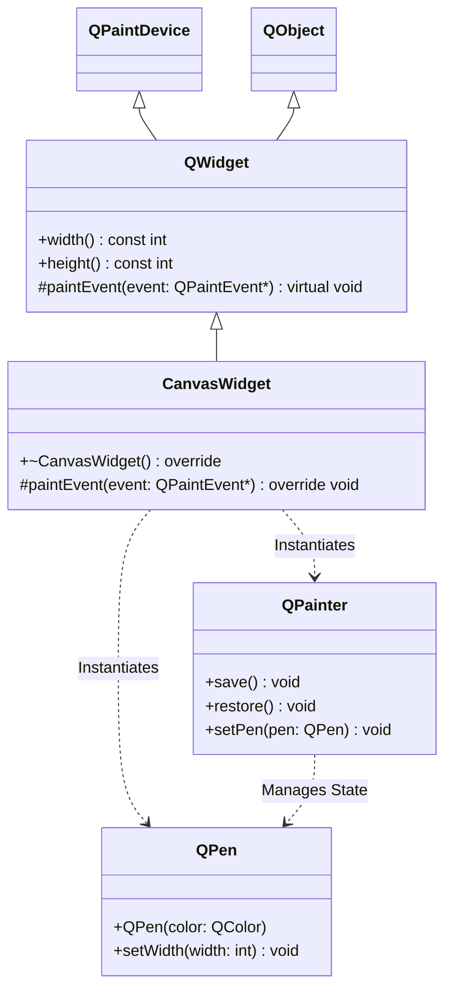
```mermaid
classDiagram
    QPaintDevice <|-- QWidget
    QObject <|-- QWidget
    QWidget <|-- CanvasWidget
    
    class QWidget {
        +width() const int
        +height() const int
        #paintEvent(event: QPaintEvent*) virtual void
    }

    class CanvasWidget {
        +~CanvasWidget() override
        #paintEvent(event: QPaintEvent*) override void
    }
    
    class QPainter {
        +save() void
        +restore() void
        +setPen(pen: QPen) void
    }
    
    class QPen {
        +QPen(color: QColor)
        +setWidth(width: int) void
    }
    
    CanvasWidget ..> QPainter : Instantiates
    CanvasWidget ..> QPen : Instantiates
    QPainter ..> QPen : Manages State
```

  

---

## qPainter_005
- [qPainter_005](../qPainter_005)
- **Brief**: Eliminating jagged pixelation by configuring the Painter with the `QPainter::Antialiasing` render hint.

**Topics:**
- Render Hints: [QPainter::setRenderHint()](https://doc.qt.io/qt-6.8/qpainter.html#setRenderHint) and [QPainter::Antialiasing](https://doc.qt.io/qt-6.8/qpainter.html#RenderHint-enum)

**Key Takeaway: Buttery Smooth Vectors**
- By default, Qt is optimized for raw performance and draws shapes using hard pixel edges (aliasing). For modern vector graphics (like TikZ diagrams), setting the `Antialiasing` flag is mandatory to activate sub-pixel color blending, resulting in smooth, professional curves and diagonal lines. This hint only affects screen/image rendering; it is completely ignored when rendering to pure vector devices like SVG or PDF, where the viewer handles smoothing.

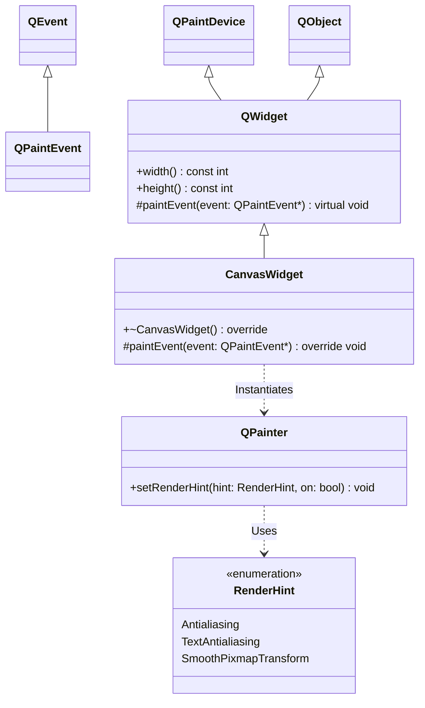
```mermaid
classDiagram
    QEvent <|-- QPaintEvent
    
    QPaintDevice <|-- QWidget
    QObject <|-- QWidget
    QWidget <|-- CanvasWidget
    
    class QWidget {
        +width() const int
        +height() const int
        #paintEvent(event: QPaintEvent*) virtual void
    }

    class CanvasWidget {
        +~CanvasWidget() override
        #paintEvent(event: QPaintEvent*) override void
    }
    
    class QPainter {
        +setRenderHint(hint: RenderHint, on: bool) void
    }
    
    class RenderHint {
        <<enumeration>>
        Antialiasing
        TextAntialiasing
        SmoothPixmapTransform
    }
    
    CanvasWidget ..> QPainter : Instantiates
    QPainter ..> RenderHint : Uses
```

---

## qPainter_006
- [qPainter_006](../qPainter_006)
- **Brief**: Managing fonts and calculating pixel-perfect text boundaries using `QFontMetrics`.

**Topics:**
- Fonts: [QFont](https://doc.qt.io/qt-6.8/qfont.html), [QPainter::setFont()](https://doc.qt.io/qt-6.8/qpainter.html#setFont), and [QPainter::font()](https://doc.qt.io/qt-6.8/qpainter.html#font)
- Metrics & Info: [QFontMetrics](https://doc.qt.io/qt-6.8/qfontmetrics.html), [QPainter::fontMetrics()](https://doc.qt.io/qt-6.8/qpainter.html#fontMetrics), [QFontInfo](https://doc.qt.io/qt-6.8/qfontinfo.html), and [QPainter::fontInfo()](https://doc.qt.io/qt-6.8/qpainter.html#fontInfo)

**Key Takeaway: The Text Baseline and Font Metrics**
- When drawing text, the Y-coordinate provided to `drawText()` is not the geometric top of the string, but the **baseline** (the invisible line that letters sit on). To perfectly center text inside a shape (like a node), you must use `QFontMetrics` to measure the exact `horizontalAdvance()` and `height()` of the string in the active font. You calculate the geometric top-left corner of the shape, and then add `QFontMetrics::ascent()` to the Y-coordinate to correctly position the text's baseline.
- **Font Abstraction**: When you request a `QFont`, the operating system might substitute it with a similar fallback font if it's missing. While `QPainter::font()` returns what you asked for, `QPainter::fontInfo()` reveals the *actual* font Qt ended up rendering on the screen.

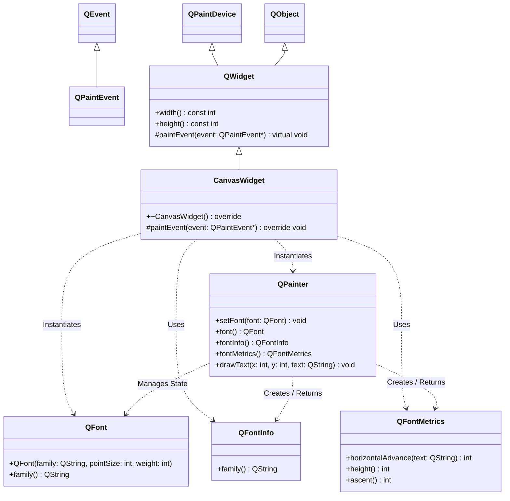
```mermaid
classDiagram
    QEvent <|-- QPaintEvent
    
    QPaintDevice <|-- QWidget
    QObject <|-- QWidget
    QWidget <|-- CanvasWidget
    
    class QWidget {
        +width() const int
        +height() const int
        #paintEvent(event: QPaintEvent*) virtual void
    }

    class CanvasWidget {
        +~CanvasWidget() override
        #paintEvent(event: QPaintEvent*) override void
    }
    
    class QPainter {
        +setFont(font: QFont) void
        +font() QFont
        +fontInfo() QFontInfo
        +fontMetrics() QFontMetrics
        +drawText(x: int, y: int, text: QString) void
    }
    
    class QFont {
        +QFont(family: QString, pointSize: int, weight: int)
        +family() QString
    }
    
    class QFontInfo {
        +family() QString
    }
    
    class QFontMetrics {
        +horizontalAdvance(text: QString) int
        +height() int
        +ascent() int
    }
    
    CanvasWidget ..> QPainter : Instantiates
    CanvasWidget ..> QFont : Instantiates
    CanvasWidget ..> QFontMetrics : Uses
    CanvasWidget ..> QFontInfo : Uses
    QPainter ..> QFont : Manages State
    QPainter ..> QFontInfo : Creates / Returns
    QPainter ..> QFontMetrics : Creates / Returns
```

   

---

## qPainter_007
- [qPainter_007](../qPainter_007)
- **Brief**: Introduction to sub-pixel coordinate precision for smooth vector geometries.

**Topics:**
- Floating-Point Primitives: [QPointF](https://doc.qt.io/qt-6.8/qpointf.html), [QLineF](https://doc.qt.io/qt-6.8/qlinef.html), [QRectF](https://doc.qt.io/qt-6.8/qrectf.html)
- `QPainter` drawing overloads: [QPainter::drawLine(const QLineF&)](https://doc.qt.io/qt-6.8/qpainter.html#drawLine), [QPainter::drawRect(const QRectF&)](https://doc.qt.io/qt-6.8/qpainter.html#drawRect)

**Key Takeaway: Integer Truncation vs. Mathematical Precision**
- When drawing procedurally (especially intersections or angled lines), coordinates are rarely perfect integers. Standard integer geometry classes (`QPoint`, `QRect`) implicitly truncate decimal values (e.g., `50.75` becomes `50`). This causes shapes to geometrically "snap" to the pixel grid, destroying mathematical accuracy and sub-pixel antialiasing. We must habitually use floating-point geometry (`*F` suffix) to feed exact decimal coordinates to `QPainter`.

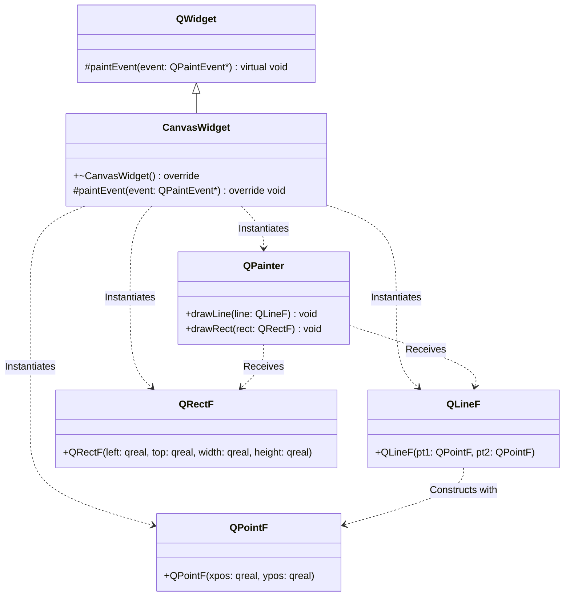
```mermaid
classDiagram
    class QPainter {
        +drawLine(line: QLineF) void
        +drawRect(rect: QRectF) void
    }
    
    class QPointF {
        +QPointF(xpos: qreal, ypos: qreal)
    }
    
    class QLineF {
        +QLineF(pt1: QPointF, pt2: QPointF)
    }
    
    class QRectF {
        +QRectF(left: qreal, top: qreal, width: qreal, height: qreal)
    }
    
    QWidget <|-- CanvasWidget
    
    class QWidget {
        #paintEvent(event: QPaintEvent*) virtual void
    }
    
    class CanvasWidget {
        +~CanvasWidget() override
        #paintEvent(event: QPaintEvent*) override void
    }
    
    CanvasWidget ..> QPainter : Instantiates
    CanvasWidget ..> QPointF : Instantiates
    CanvasWidget ..> QLineF : Instantiates
    CanvasWidget ..> QRectF : Instantiates
    
    QLineF ..> QPointF : Constructs with
    
    QPainter ..> QLineF : Receives
    QPainter ..> QRectF : Receives
```

 

---

## qPainter_008
- [qPainter_008](../qPainter_008)
- **Brief**: High-performance batch drawing of points and lines.

**Topics:**
- Batch Primitives: [QPainter::drawPoints()](https://doc.qt.io/qt-6.8/qpainter.html#drawPoints), [QPainter::drawLines()](https://doc.qt.io/qt-6.8/qpainter.html#drawLines)
- Containers: `QList<T>`, C-Style Arrays

**Key Takeaway: Graphics Pipeline Efficiency**
- Calling `drawPoint()` or `drawLine()` thousands of times in a loop forces the graphics engine to context-switch constantly. By packing all your geometric primitives into a single array (or `QList`) and passing it to the batch `drawPoints()` or `drawLines()` overloads, the GPU (or underlying raster engine) processes the entire batch in a single highly optimized pass. This is critical for drawing large grids, complex TikZ nodes, or dense scatter plots.

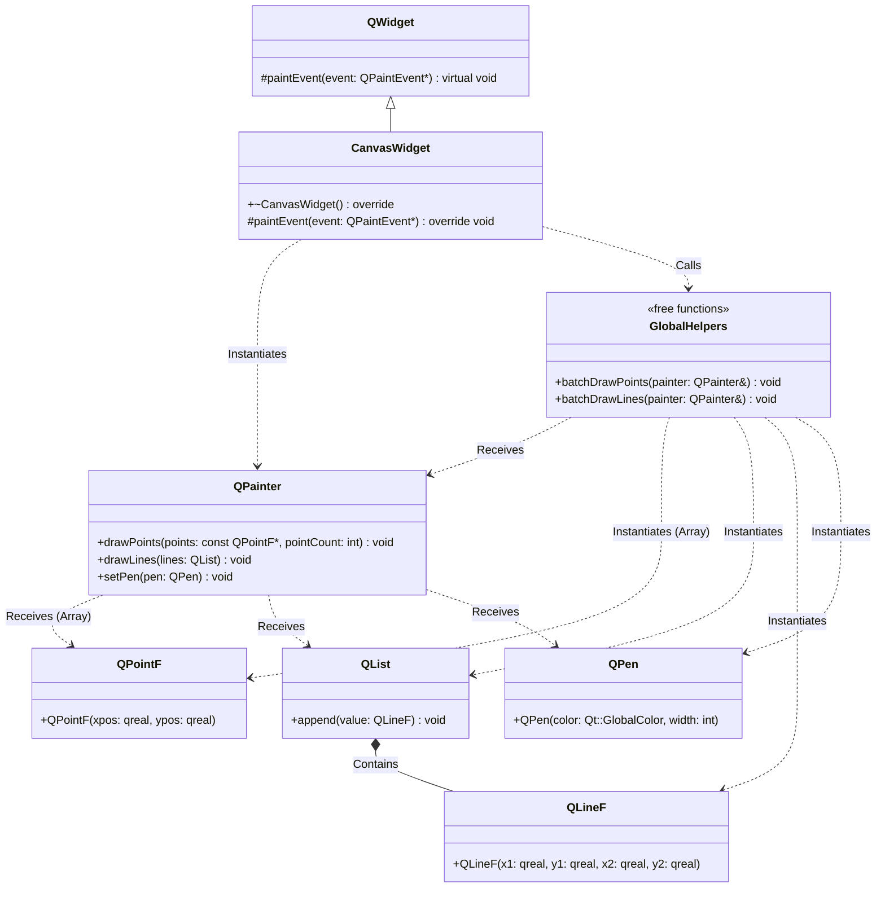
```mermaid
classDiagram
    class QPainter {
        +drawPoints(points: const QPointF*, pointCount: int) void
        +drawLines(lines: QList) void
        +setPen(pen: QPen) void
    }
    
    class QPen {
        +QPen(color: Qt::GlobalColor, width: int)
    }
    
    class QPointF {
        +QPointF(xpos: qreal, ypos: qreal)
    }
    
    class QLineF {
        +QLineF(x1: qreal, y1: qreal, x2: qreal, y2: qreal)
    }
    
    class QList {
        +append(value: QLineF) void
    }
    
    QWidget <|-- CanvasWidget
    
    class QWidget {
        #paintEvent(event: QPaintEvent*) virtual void
    }
    
    class CanvasWidget {
        +~CanvasWidget() override
        #paintEvent(event: QPaintEvent*) override void
    }
    
    class GlobalHelpers {
        <<free functions>>
        +batchDrawPoints(painter: QPainter&) void
        +batchDrawLines(painter: QPainter&) void
    }
    
    CanvasWidget ..> QPainter : Instantiates
    CanvasWidget ..> GlobalHelpers : Calls
    
    GlobalHelpers ..> QPainter : Receives
    GlobalHelpers ..> QPointF : Instantiates (Array)
    GlobalHelpers ..> QList : Instantiates
    GlobalHelpers ..> QLineF : Instantiates
    GlobalHelpers ..> QPen : Instantiates
    
    QList *-- QLineF : Contains
    
    QPainter ..> QPointF : Receives (Array)
    QPainter ..> QList : Receives
    QPainter ..> QPen : Receives
```
 

---

## qPainter_009
- [qPainter_009](../qPainter_009)
- **Brief**: Fast solid fills and geometric erasing.

**Topics:**
- Direct Manipulation: [QPainter::fillRect()](https://doc.qt.io/qt-6.8/qpainter.html#fillRect), [QPainter::eraseRect()](https://doc.qt.io/qt-6.8/qpainter.html#eraseRect)

**Key Takeaway: Direct Screen Painting**
- Unlike standard `drawRect()` which strokes a path using the current `QPen` and fills it using the current `QBrush`, `fillRect()` is a highly optimized fast-path that ignores the pen/brush and blasts a raw color (or gradient) directly into the rectangle bounds. 
- `eraseRect()` is mathematically identical to drawing a rectangle filled with the widget's default background color (`window()` color), effectively punching a hole through previously rendered layers. This is significantly cheaper computationally than using complex clipping paths to mask out regions.

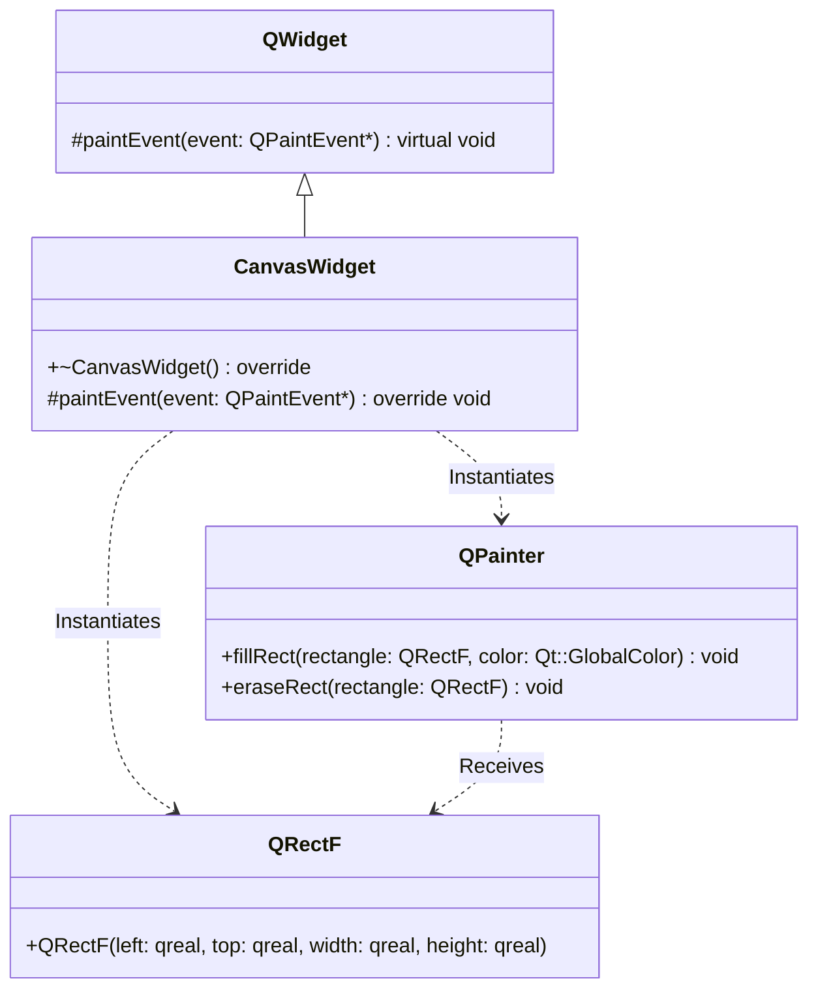
```mermaid
classDiagram
    QWidget <|-- CanvasWidget
    
    class QWidget {
        #paintEvent(event: QPaintEvent*) virtual void
    }
    
    class QPainter {
        +fillRect(rectangle: QRectF, color: Qt::GlobalColor) void
        +eraseRect(rectangle: QRectF) void
    }
    
    class QRectF {
        +QRectF(left: qreal, top: qreal, width: qreal, height: qreal)
    }
    
    class CanvasWidget {
        +~CanvasWidget() override
        #paintEvent(event: QPaintEvent*) override void
    }
    
    CanvasWidget ..> QPainter : Instantiates
    CanvasWidget ..> QRectF : Instantiates
    
    QPainter ..> QRectF : Receives
```

 

---

## qPainter_010
- [qPainter_010](../qPainter_010)
- **Brief**: Drawing curved shapes using bounding boxes and 1/16th degree integer angles.

**Topics:**
- Drawing Primitives: [QPainter::drawEllipse()](https://doc.qt.io/qt-6.8/qpainter.html#drawEllipse), [QPainter::drawArc()](https://doc.qt.io/qt-6.8/qpainter.html#drawArc), [QPainter::drawPie()](https://doc.qt.io/qt-6.8/qpainter.html#drawPie), [QPainter::drawChord()](https://doc.qt.io/qt-6.8/qpainter.html#drawChord)

**Key Takeaway: The Bounding Box Architecture**
- Almost all GUI rendering engines (including Qt) define curves by their enclosing `QRectF` rather than a mathematical center point and radius. This allows the GPU/Rasterizer to instantly calculate clipping boundaries and determine exactly which screen pixels need to be evaluated, maximizing graphics performance.
- For partial curves (Arcs, Pies, Chords), angles are provided as integers representing `1/16ths of a degree`. This legacy design decision (inherited from X11) provided sub-degree precision ($0.0625^\circ$) without the severe performance penalty of using floating-point math on 1990s hardware.

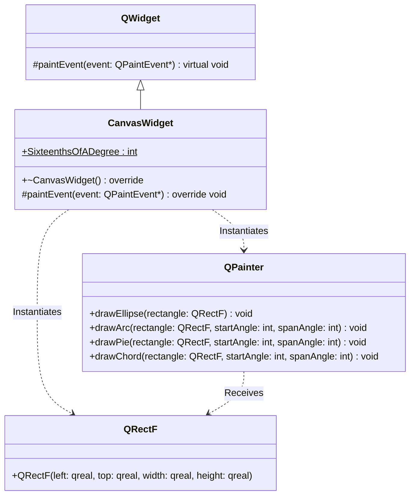
```mermaid
classDiagram
    QWidget <|-- CanvasWidget
    
    class QWidget {
        #paintEvent(event: QPaintEvent*) virtual void
    }
    
    class CanvasWidget {
        +SixteenthsOfADegree : int$
        +~CanvasWidget() override
        #paintEvent(event: QPaintEvent*) override void
    }
    
    class QPainter {
        +drawEllipse(rectangle: QRectF) void
        +drawArc(rectangle: QRectF, startAngle: int, spanAngle: int) void
        +drawPie(rectangle: QRectF, startAngle: int, spanAngle: int) void
        +drawChord(rectangle: QRectF, startAngle: int, spanAngle: int) void
    }
    
    class QRectF {
        +QRectF(left: qreal, top: qreal, width: qreal, height: qreal)
    }
    
    CanvasWidget ..> QPainter : Instantiates
    CanvasWidget ..> QRectF : Instantiates
    
    QPainter ..> QRectF : Receives
```

   

---

## qPainter_011
- [qPainter_011](../qPainter_011)
- **Brief**: Building an intuitive math abstraction layer (TikZ-style API) over Qt's bounding box requirements.

**Topics:**
- Architectural Patterns: Inline Helper Functions, Stateless Functional Wrappers, Overload Resolution.

**Key Takeaway: The Stateless Abstraction Pattern**
- By creating `inline` helper methods within `canvaswidget.hpp`, we successfully decoupled mathematical intent (centers and radii) from Qt's rendering requirements (bounding boxes and $1/16^{\text{th}}$ degrees) without sacrificing any CPU performance or introducing heavy stateful wrapper classes. 
- The design allows the user to write clean `paintEvent` code (`drawPieIntuitive(...)`) while ensuring that the "Highlander Rule" of Qt rendering is respected (only one `QPainter` active per widget, passed dynamically by reference).

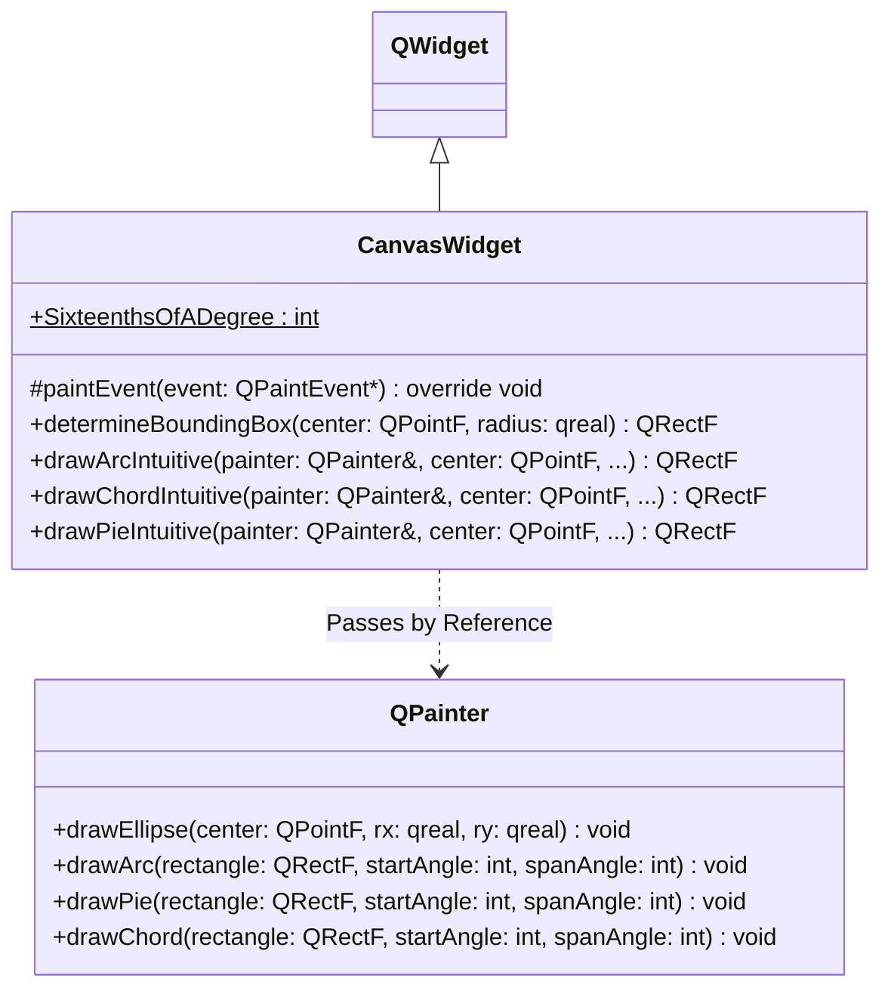
```mermaid
classDiagram
    QWidget <|-- CanvasWidget
    
    class CanvasWidget {
        +SixteenthsOfADegree : int$
        #paintEvent(event: QPaintEvent*) override void
        +determineBoundingBox(center: QPointF, radius: qreal) QRectF
        +drawArcIntuitive(painter: QPainter&, center: QPointF, ...) QRectF
        +drawChordIntuitive(painter: QPainter&, center: QPointF, ...) QRectF
        +drawPieIntuitive(painter: QPainter&, center: QPointF, ...) QRectF
    }
    
    class QPainter {
        +drawEllipse(center: QPointF, rx: qreal, ry: qreal) void
        +drawArc(rectangle: QRectF, startAngle: int, spanAngle: int) void
        +drawPie(rectangle: QRectF, startAngle: int, spanAngle: int) void
        +drawChord(rectangle: QRectF, startAngle: int, spanAngle: int) void
    }
    
    CanvasWidget ..> QPainter : Passes by Reference
```

   

---

## qPainter_012
- [qPainter_012](../qPainter_012)
- **Brief**: Drawing standard rectangles, batched rectangle lists, and dynamically scaling rounded rectangles.

**Topics:**
- Drawing Primitives: [QPainter::drawRect()](https://doc.qt.io/qt-6.8/qpainter.html#drawRect), [QPainter::drawRects()](https://doc.qt.io/qt-6.8/qpainter.html#drawRects), [QPainter::drawRoundedRect()](https://doc.qt.io/qt-6.8/qpainter.html#drawRoundedRect)

**Key Takeaway: Batch Rendering and Dynamic Radii**
- Passing a `QList<QRectF>` into `drawRects()` allows Qt to batch-render massive grids or tilemaps with a single draw call, bypassing the heavy overhead of iterating `drawRect()` in a native C++ loop.
- `drawRoundedRect()` is incredibly flexible thanks to the `Qt::SizeMode` enum. `Qt::AbsoluteSize` enforces exact pixel curves (e.g. `15.0`), ensuring UI borders don't stretch irregularly when a widget resizes. `Qt::RelativeSize` (measured $0.0-100.0$) creates fluid borders that scale dynamically with the aspect ratio, making it effortless to generate pill shapes or dynamic circular avatars.

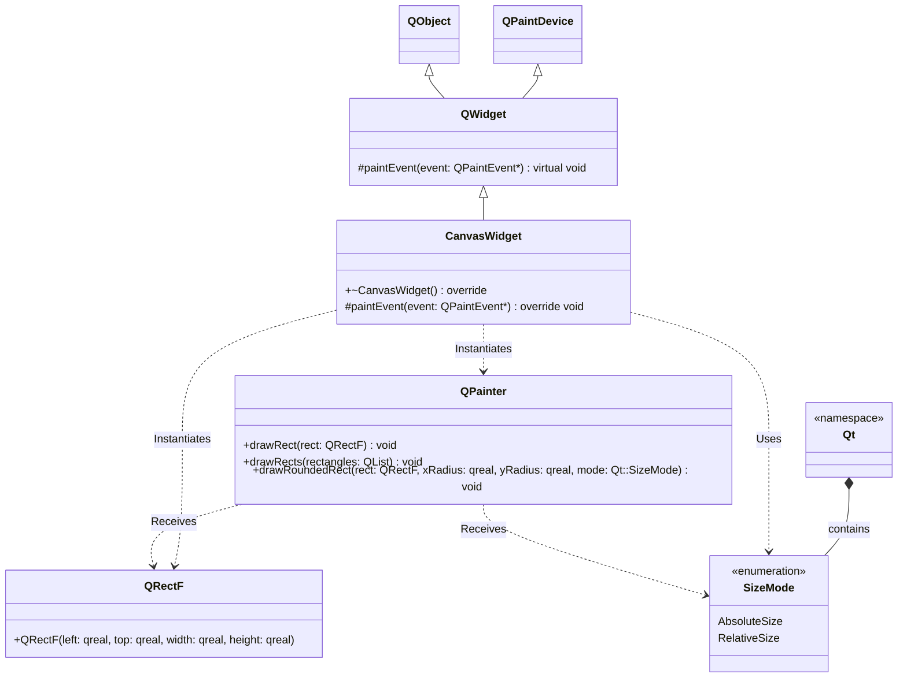
```mermaid
classDiagram
    class QPainter {
        +drawRect(rect: QRectF) void
        +drawRects(rectangles: QList) void
        +drawRoundedRect(rect: QRectF, xRadius: qreal, yRadius: qreal, mode: Qt::SizeMode) void
    }
    
    class QRectF {
        +QRectF(left: qreal, top: qreal, width: qreal, height: qreal)
    }
    
    class Qt {
        <<namespace>>
    }
    
    class SizeMode {
        <<enumeration>>
        AbsoluteSize
        RelativeSize
    }
    
    QPaintDevice <|-- QWidget
    QObject <|-- QWidget
    QWidget <|-- CanvasWidget
    
    class QWidget {
        #paintEvent(event: QPaintEvent*) virtual void
    }
    
    class CanvasWidget {
        +~CanvasWidget() override
        #paintEvent(event: QPaintEvent*) override void
    }
    
    Qt *-- SizeMode : contains
    
    CanvasWidget ..> QPainter : Instantiates
    CanvasWidget ..> QRectF : Instantiates
    CanvasWidget ..> SizeMode : Uses
    
    QPainter ..> QRectF : Receives
    QPainter ..> SizeMode : Receives
```

  

---

## qPainter_013
- [qPainter_013](../qPainter_013)
- **Brief**: Exploring complex vector paths by comparing open Polylines, closed Polygons, and highly optimized Convex Polygons.

**Topics:**
- Vector Paths: [QPolygonF](https://doc.qt.io/qt-6.8/qpolygonf.html), [QPainter::drawPolyline()](https://doc.qt.io/qt-6.8/qpainter.html#drawPolyline), [QPainter::drawPolygon()](https://doc.qt.io/qt-6.8/qpainter.html#drawPolygon), [QPainter::drawConvexPolygon()](https://doc.qt.io/qt-6.8/qpainter.html#drawConvexPolygon)

**Key Takeaway: The Fill Rule of Open vs. Closed Paths**
- **`drawPolyline`**: Strictly defines an open, continuous stroke. Because it has no "inside", it completely ignores the active `QBrush` and only renders the `QPen`.
- **`drawPolygon`**: Defines a closed shape by automatically connecting the final point back to the first point. It fully respects the active `QBrush` to fill its interior.

**Key Takeaway: The Convex Optimization**
- Mathematical Convexity: A convex shape (like a Triangle or Hexagon) has no internal angles greater than 180 degrees (i.e., no "dents").
- Performance: Because convex shapes are mathematically simple, the rasterization engine can use a significantly faster algorithm to fill them. By explicitly calling `drawConvexPolygon()`, you bypass the heavy mathematics required to fill complex, self-intersecting polygons (like a 5-pointed star). *Warning: Passing a non-convex shape to this method results in visual corruption.*

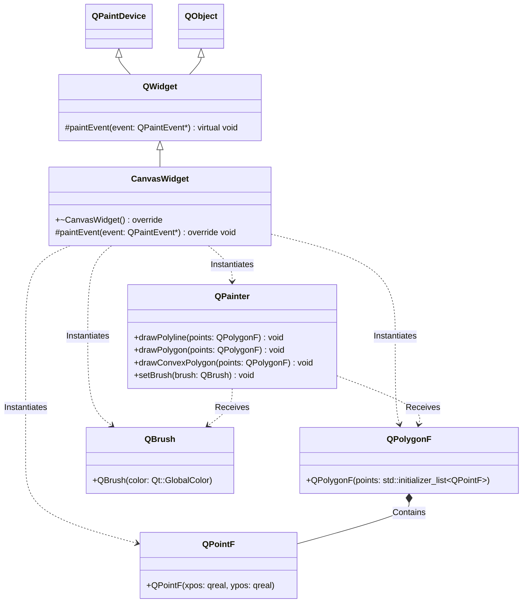
```mermaid
classDiagram
    class QPainter {
        +drawPolyline(points: QPolygonF) void
        +drawPolygon(points: QPolygonF) void
        +drawConvexPolygon(points: QPolygonF) void
        +setBrush(brush: QBrush) void
    }
    
    class QPolygonF {
        +QPolygonF(points: std::initializer_list~QPointF~)
    }
    
    class QPointF {
        +QPointF(xpos: qreal, ypos: qreal)
    }
    
    class QBrush {
        +QBrush(color: Qt::GlobalColor)
    }
    
    QPaintDevice <|-- QWidget
    QObject <|-- QWidget
    QWidget <|-- CanvasWidget
    
    class QWidget {
        #paintEvent(event: QPaintEvent*) virtual void
    }
    
    class CanvasWidget {
        +~CanvasWidget() override
        #paintEvent(event: QPaintEvent*) override void
    }
    
    CanvasWidget ..> QPainter : Instantiates
    CanvasWidget ..> QPolygonF : Instantiates
    CanvasWidget ..> QPointF : Instantiates
    CanvasWidget ..> QBrush : Instantiates
    
    QPolygonF *-- QPointF : Contains
    
    QPainter ..> QPolygonF : Receives
    QPainter ..> QBrush : Receives
```

  

---

## qPainter_014
- [qPainter_014](../qPainter_014)
- **Brief**: Managing text alignment for localization using `QPainter::setLayoutDirection()`.

**Topics:**
- Global State: [QPainter::setLayoutDirection()](https://doc.qt.io/qt-6.8/qpainter.html#setLayoutDirection), [Qt::LayoutDirection](https://doc.qt.io/qt-6.8/qt.html#LayoutDirection-enum)

**Key Takeaway: Alignment Mirroring**
- When drawing text via `QPainter::drawText(QRect, int flags, QString)` using standard alignment flags (e.g. `Qt::AlignLeft`), changing the layout direction to `Qt::RightToLeft` automatically "mirrors" the alignment. `Qt::AlignLeft` visually behaves like `Qt::AlignRight`.
- This is a critical feature for building UIs that support RTL languages (like Arabic or Hebrew) because it prevents you from needing to manually rewrite all of your layout logic; Qt simply inverts the horizontal text flow automatically.
- *Developer Discovery*: If you bypass the standard alignment flags and use the `QTextOption` overload of `drawText` without explicitly configuring it for RTL, the text will ignore the painter's Layout Direction and fall back to LTR!

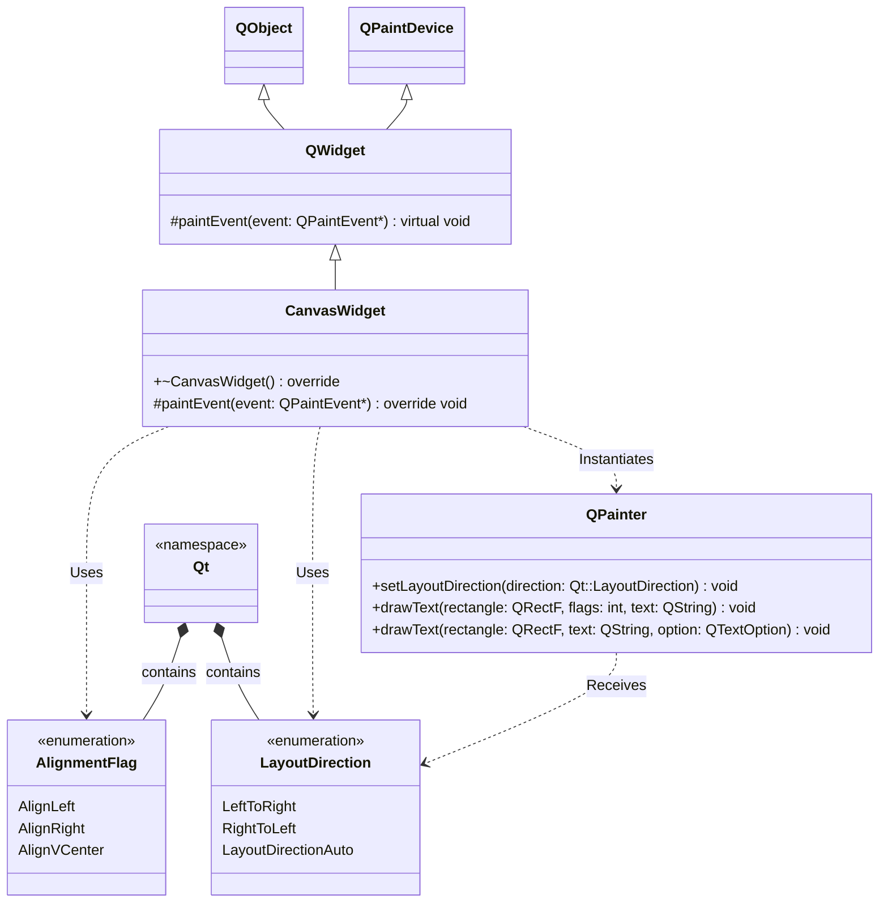
```mermaid
classDiagram
    class QPainter {
        +setLayoutDirection(direction: Qt::LayoutDirection) void
        +drawText(rectangle: QRectF, flags: int, text: QString) void
        +drawText(rectangle: QRectF, text: QString, option: QTextOption) void
    }
    
    class Qt {
        <<namespace>>
    }
    
    class LayoutDirection {
        <<enumeration>>
        LeftToRight
        RightToLeft
        LayoutDirectionAuto
    }
    
    class AlignmentFlag {
        <<enumeration>>
        AlignLeft
        AlignRight
        AlignVCenter
    }
    
    QPaintDevice <|-- QWidget
    QObject <|-- QWidget
    QWidget <|-- CanvasWidget
    
    class QWidget {
        #paintEvent(event: QPaintEvent*) virtual void
    }
    
    class CanvasWidget {
        +~CanvasWidget() override
        #paintEvent(event: QPaintEvent*) override void
    }
    
    Qt *-- LayoutDirection : contains
    Qt *-- AlignmentFlag : contains
    
    CanvasWidget ..> QPainter : Instantiates
    CanvasWidget ..> LayoutDirection : Uses
    CanvasWidget ..> AlignmentFlag : Uses
    
    QPainter ..> LayoutDirection : Receives
```

---

## qPainter_015
- [qPainter_015](../qPainter_015)
- **Brief**: Deep dive into `QPen` styling including custom dash patterns, line caps, and corner joins.

**Topics:**
- Pen Caps: `Qt::FlatCap`, `Qt::SquareCap`, `Qt::RoundCap`
- Pen Joins: `Qt::MiterJoin`, `Qt::BevelJoin`, `Qt::RoundJoin`
- Dash Patterns: `QPen::setDashPattern()`

**Key Takeaway: Cap Bleed**
- A critical detail of `Qt::SquareCap` and `Qt::RoundCap` is that they extend *past* the mathematical start and end coordinates of the line by exactly half of the pen's width. If drawing thick lines near the edge of a clipping box or bounding rect, `Qt::FlatCap` is the only safe cap that remains strictly inside the geometric coordinates.

**Key Takeaway: Custom Dashes**
- Rather than relying on the standard `Qt::DashLine` or `Qt::DotLine`, you can feed `setDashPattern()` an exact sequence of multipliers (e.g. `[4.0, 2.0, 1.0, 2.0]` for solid, empty, solid, empty). These numbers are multiplied by the `QPen`'s width to determine the exact pixel length of each dash and gap, allowing you to perfectly recreate complex SVG strokes or Morse-code-style borders.

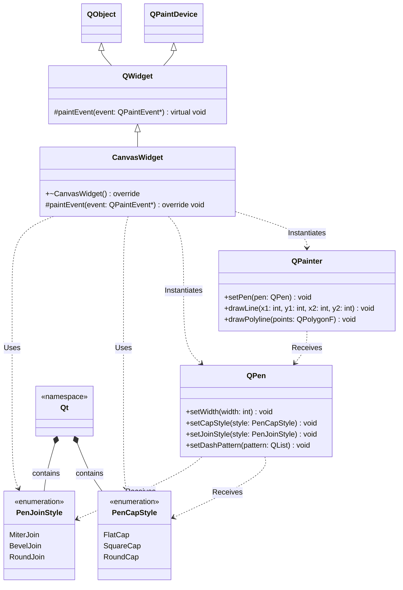
```mermaid
classDiagram
    class QPainter {
        +setPen(pen: QPen) void
        +drawLine(x1: int, y1: int, x2: int, y2: int) void
        +drawPolyline(points: QPolygonF) void
    }
    
    class QPen {
        +setWidth(width: int) void
        +setCapStyle(style: PenCapStyle) void
        +setJoinStyle(style: PenJoinStyle) void
        +setDashPattern(pattern: QList) void
    }
    
    class Qt {
        <<namespace>>
    }
    
    class PenCapStyle {
        <<enumeration>>
        FlatCap
        SquareCap
        RoundCap
    }
    
    class PenJoinStyle {
        <<enumeration>>
        MiterJoin
        BevelJoin
        RoundJoin
    }
    
    QPaintDevice <|-- QWidget
    QObject <|-- QWidget
    QWidget <|-- CanvasWidget
    
    class QWidget {
        #paintEvent(event: QPaintEvent*) virtual void
    }
    
    class CanvasWidget {
        +~CanvasWidget() override
        #paintEvent(event: QPaintEvent*) override void
    }
    
    Qt *-- PenCapStyle : contains
    Qt *-- PenJoinStyle : contains
    
    CanvasWidget ..> QPainter : Instantiates
    CanvasWidget ..> QPen : Instantiates
    CanvasWidget ..> PenCapStyle : Uses
    CanvasWidget ..> PenJoinStyle : Uses
    
    QPainter ..> QPen : Receives
    QPen ..> PenCapStyle : Receives
    QPen ..> PenJoinStyle : Receives
```

   

---

## qPainter_016
- [qPainter_016](../qPainter_016)
- **Brief**: Exploring `QBrush` patterns, manipulating transparent vs opaque background modes, and controlling the brush origin to anchor patterns to shapes rather than the window.

**Topics:**
- Brush Patterns: `Qt::CrossPattern`, `Qt::DiagCrossPattern`
- Background Modes: `Qt::TransparentMode` (default) vs `Qt::OpaqueMode`
- Brush Origin: `QPainter::setBrushOrigin()`

**Key Takeaway: The "Opaque" Text Gotcha**
- When `setBackgroundMode(Qt::OpaqueMode)` is active, it doesn't just fill the empty space in hatched brush patterns—it also draws a solid colored box behind all text rendered with `drawText()`. This is highly useful for making text readable over busy backgrounds, but can be a surprise if left active accidentally. Always use `save()` and `restore()`!

**Key Takeaway: The Sliding Window Effect**
- By default, brush patterns are universally anchored to `(0,0)` of the window. If you draw a shape, it acts like a sliding window revealing a static wallpaper behind it. To make a pattern "stick" to a shape as it moves across the screen, you must use `setBrushOrigin()` to anchor the texture's starting point to the shape's local coordinates.

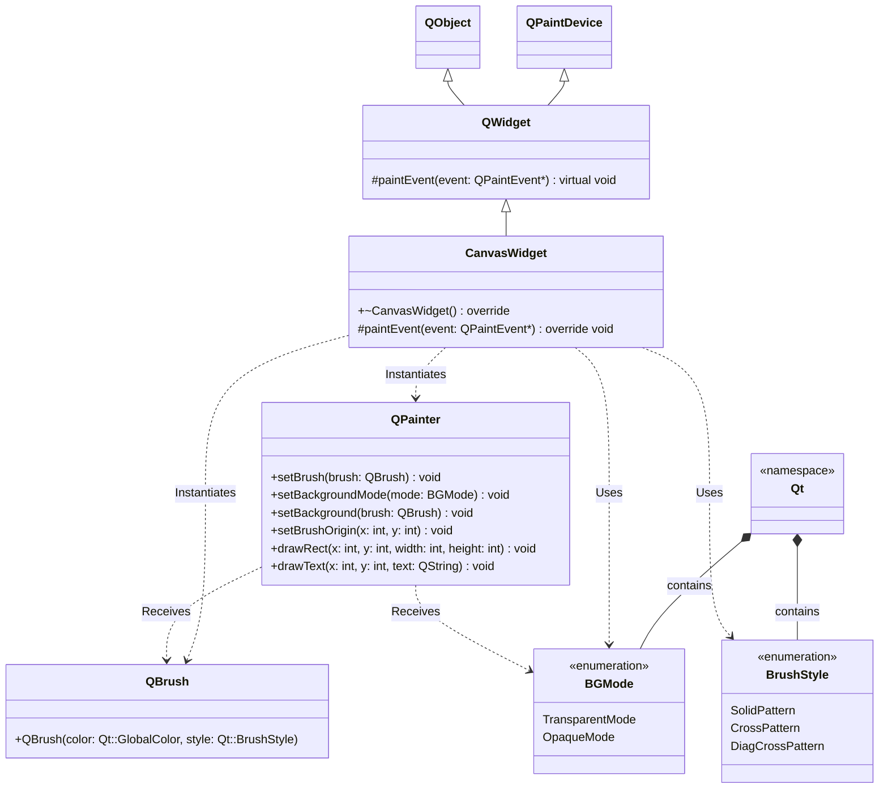
```mermaid
classDiagram
    class QPainter {
        +setBrush(brush: QBrush) void
        +setBackgroundMode(mode: BGMode) void
        +setBackground(brush: QBrush) void
        +setBrushOrigin(x: int, y: int) void
        +drawRect(x: int, y: int, width: int, height: int) void
        +drawText(x: int, y: int, text: QString) void
    }
    
    class QBrush {
        +QBrush(color: Qt::GlobalColor, style: Qt::BrushStyle)
    }
    
    class Qt {
        <<namespace>>
    }
    
    class BrushStyle {
        <<enumeration>>
        SolidPattern
        CrossPattern
        DiagCrossPattern
    }
    
    class BGMode {
        <<enumeration>>
        TransparentMode
        OpaqueMode
    }
    
    QPaintDevice <|-- QWidget
    QObject <|-- QWidget
    QWidget <|-- CanvasWidget
    
    class QWidget {
        #paintEvent(event: QPaintEvent*) virtual void
    }
    
    class CanvasWidget {
        +~CanvasWidget() override
        #paintEvent(event: QPaintEvent*) override void
    }
    
    Qt *-- BrushStyle : contains
    Qt *-- BGMode : contains
    
    CanvasWidget ..> QPainter : Instantiates
    CanvasWidget ..> QBrush : Instantiates
    CanvasWidget ..> BrushStyle : Uses
    CanvasWidget ..> BGMode : Uses
    
    QPainter ..> QBrush : Receives
    QPainter ..> BGMode : Receives
```

    

---

## qPainter_017
- [qPainter_017](../qPainter_017)
- **Brief**: Mastering smooth vector color transitions across lines, circles, and cones using Qt's gradient classes and spread modes.

**Topics:**
- Linear Gradients: `QLinearGradient`
- Radial Gradients: `QRadialGradient`
- Conical Gradients: `QConicalGradient`
- Gradient Spread Behaviors: `QGradient::PadSpread`, `QGradient::RepeatSpread`, `QGradient::ReflectSpread`

**Key Takeaway: The Brush Pipeline**
- Gradients in Qt are not independent painting operations. They are complex color patterns fed directly into a standard `QBrush`. Once a gradient is assigned to a brush, standard primitives like `drawRect` and `drawEllipse` will automatically paint using the gradient's interpolation mathematics.

**Key Takeaway: Spread Modes**
- If a shape is physically larger than the geometric bounding box defined by a `QLinearGradient` or `QRadialGradient`, the `setSpread()` property determines what happens to the remaining empty space. `PadSpread` (default) simply holds and stretches the final color value. `RepeatSpread` performs a harsh loop back to 0%. `ReflectSpread` bounces back and forth, smoothly interpolating forward and backward for seamless repeating textures.

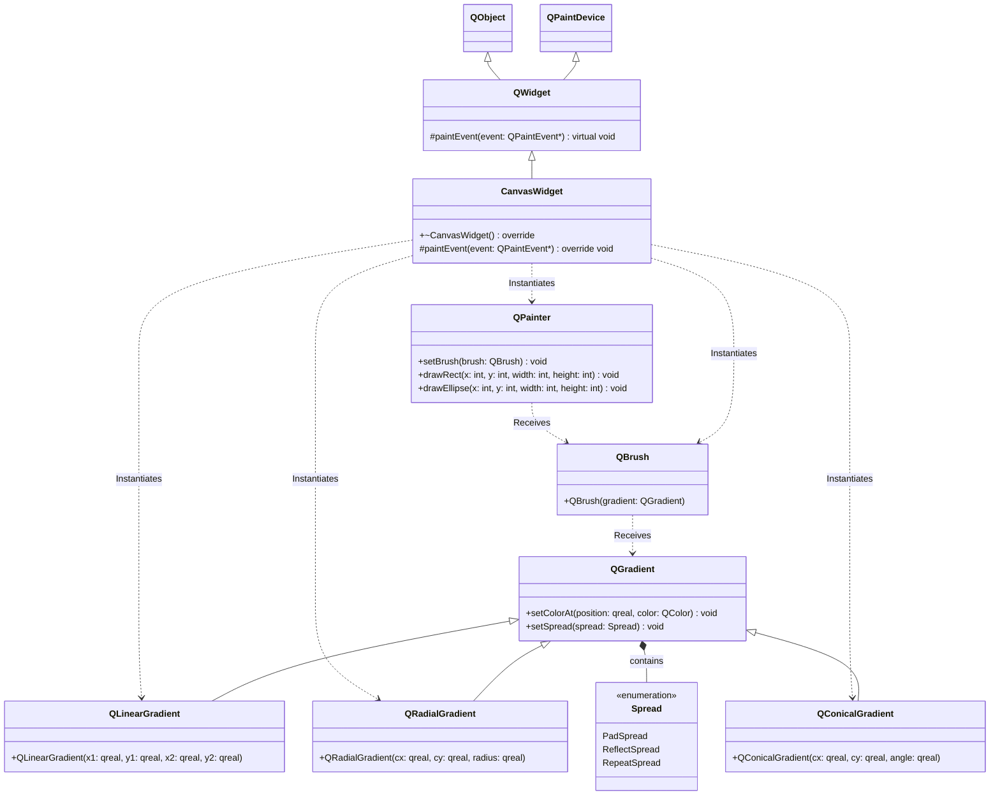
```mermaid
classDiagram
    class QPainter {
        +setBrush(brush: QBrush) void
        +drawRect(x: int, y: int, width: int, height: int) void
        +drawEllipse(x: int, y: int, width: int, height: int) void
    }
    
    class QBrush {
        +QBrush(gradient: QGradient)
    }
    
    class QGradient {
        +setColorAt(position: qreal, color: QColor) void
        +setSpread(spread: Spread) void
    }
    
    class QLinearGradient {
        +QLinearGradient(x1: qreal, y1: qreal, x2: qreal, y2: qreal)
    }
    
    class QRadialGradient {
        +QRadialGradient(cx: qreal, cy: qreal, radius: qreal)
    }
    
    class QConicalGradient {
        +QConicalGradient(cx: qreal, cy: qreal, angle: qreal)
    }
    
    class Spread {
        <<enumeration>>
        PadSpread
        ReflectSpread
        RepeatSpread
    }
    
    QGradient <|-- QLinearGradient
    QGradient <|-- QRadialGradient
    QGradient <|-- QConicalGradient
    
    QGradient *-- Spread : contains
    
    QPaintDevice <|-- QWidget
    QObject <|-- QWidget
    QWidget <|-- CanvasWidget
    
    class QWidget {
        #paintEvent(event: QPaintEvent*) virtual void
    }
    
    class CanvasWidget {
        +~CanvasWidget() override
        #paintEvent(event: QPaintEvent*) override void
    }
    
    CanvasWidget ..> QPainter : Instantiates
    CanvasWidget ..> QLinearGradient : Instantiates
    CanvasWidget ..> QRadialGradient : Instantiates
    CanvasWidget ..> QConicalGradient : Instantiates
    CanvasWidget ..> QBrush : Instantiates
    
    QPainter ..> QBrush : Receives
    QBrush ..> QGradient : Receives
```

    

---

## qPainter_018
- [qPainter_018](../qPainter_018)
- **Brief**: Introduction to Affine Transformations. Instead of drawing shapes at different geometric coordinates, we move, scale, rotate, and shear the coordinate system itself while drawing the shapes at `(0,0)`.

**Topics:**
- Translation: `QPainter::translate()`
- Scaling: `QPainter::scale()`
- Rotation: `QPainter::rotate()`
- Shearing: `QPainter::shear()`

**Key Takeaway: The Inverted Y-Axis Gotcha**
- In standard Cartesian math (where Y points up), a positive horizontal shear shifts the *top* of a shape to the right, creating a right-leaning shape (like *italic* text).
- Because Qt's Y-axis points **down**, positive Y values push the X coordinate to the right. This means the *bottom* of the shape is pushed to the right, causing the shape to visually lean to the **left**! To create a standard right-leaning shear in Qt, you must pass a negative horizontal shear value.

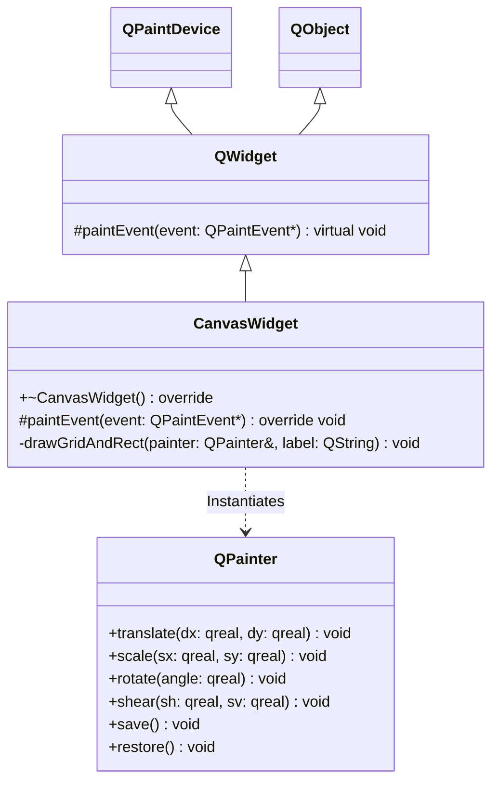
```mermaid
classDiagram
    QPaintDevice <|-- QWidget
    QObject <|-- QWidget
    QWidget <|-- CanvasWidget
    
    class QWidget {
        #paintEvent(event: QPaintEvent*) virtual void
    }
    
    class CanvasWidget {
        +~CanvasWidget() override
        #paintEvent(event: QPaintEvent*) override void
        -drawGridAndRect(painter: QPainter&, label: QString) void
    }
    
    class QPainter {
        +translate(dx: qreal, dy: qreal) void
        +scale(sx: qreal, sy: qreal) void
        +rotate(angle: qreal) void
        +shear(sh: qreal, sv: qreal) void
        +save() void
        +restore() void
    }
    
    CanvasWidget ..> QPainter : Instantiates
```

   

---

## qPainter_019
- [qPainter_019](../qPainter_019)
- **Brief**: Peeling back the abstraction layer of `QPainter`'s convenience transformation methods to inspect and manually manipulate the underlying `QTransform` matrix engine.

**Topics:**
- Inspecting Matrix State: `QPainter::worldTransform()`
- Resetting Matrix State: `QPainter::resetTransform()`
- Overriding Matrix State: `QPainter::setWorldTransform()`
- `QTransform` API

**Key Takeaway: The `QTransform` Blueprint**
- `QPainter` drives its coordinate system using a 3x3 Affine Transformation matrix. Every time you call a convenience method like `painter.rotate()`, Qt performs trigonometry to update 4 cells in this matrix simultaneously.

| Matrix Cell | Qt Method Equivalent | What it controls | Default (Identity) |
| :---: | :--- | :--- | :---: |
| **`m11`** | `scale(sx, ...)` | **Horizontal Scale** (X stretch) | `1.0` |
| **`m12`** | `shear(..., sv)` | **Vertical Shear** (Skews Y based on X) | `0.0` |
| **`m13`** | *(Advanced)* | Horizontal Projection (Perspective) | `0.0` |
| **`m21`** | `shear(sh, ...)` | **Horizontal Shear** (Skews X based on Y) | `0.0` |
| **`m22`** | `scale(..., sy)` | **Vertical Scale** (Y stretch) | `1.0` |
| **`m23`** | *(Advanced)* | Vertical Projection (Perspective) | `0.0` |
| **`m31`** | `translate(dx, ...)` | **Horizontal Translation** (Move X) | `0.0` |
| **`m32`** | `translate(..., dy)` | **Vertical Translation** (Move Y) | `0.0` |
| **`m33`** | *(Advanced)* | Global Scale / Projection factor | `1.0` |

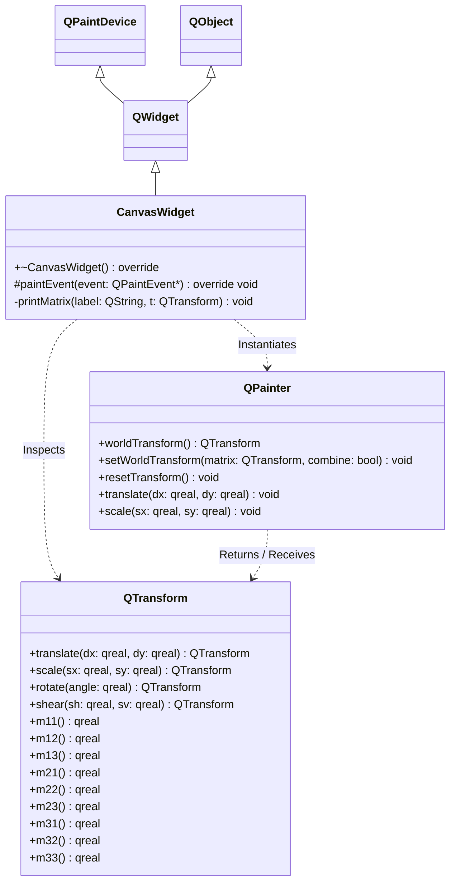
```mermaid
classDiagram
    QPaintDevice <|-- QWidget
    QObject <|-- QWidget
    QWidget <|-- CanvasWidget
    
    class CanvasWidget {
        +~CanvasWidget() override
        #paintEvent(event: QPaintEvent*) override void
        -printMatrix(label: QString, t: QTransform) void
    }
    
    class QPainter {
        +worldTransform() QTransform
        +setWorldTransform(matrix: QTransform, combine: bool) void
        +resetTransform() void
        +translate(dx: qreal, dy: qreal) void
        +scale(sx: qreal, sy: qreal) void
    }
    
    class QTransform {
        +translate(dx: qreal, dy: qreal) QTransform
        +scale(sx: qreal, sy: qreal) QTransform
        +rotate(angle: qreal) QTransform
        +shear(sh: qreal, sv: qreal) QTransform
        +m11() qreal
        +m12() qreal
        +m13() qreal
        +m21() qreal
        +m22() qreal
        +m23() qreal
        +m31() qreal
        +m32() qreal
        +m33() qreal
    }
    
    CanvasWidget ..> QPainter : Instantiates
    CanvasWidget ..> QTransform : Inspects
    QPainter ..> QTransform : Returns / Receives
```

  

---

## qPainter_020
- [qPainter_020](../qPainter_020)
- **Brief**: Introduction to Logical-to-Physical coordinate mapping using `setWindow()` and `setViewport()`.

**Topics:**
- Logical Coordinate System (Window): `QPainter::setWindow()`
- Physical Pixel Mapping (Viewport): `QPainter::setViewport()`

**Key Takeaway: The Chessboard Analogy**
- The **Viewport** is the physical screen on your monitor (measured in raw pixels). 
- The **Window** is your mathematical coordinate system (measured in whatever logical units you want). 
- If you want to draw an 8x8 chessboard, you can `setWindow(0, 0, 8, 8)` and simply draw 1x1 rectangles. Qt will automatically scale and translate those logical 1x1 squares to fill whatever physical pixel space you defined in the Viewport!
- **The Math**: `Physical Pixels = Logical Units * (Viewport Size / Window Size)`. For example, if your logical window is 8 units wide, and your physical viewport is 800 pixels wide, a logical rectangle of width 1 (one chess square) becomes `1 * (800 / 8) = 100` physical pixels wide on the screen.

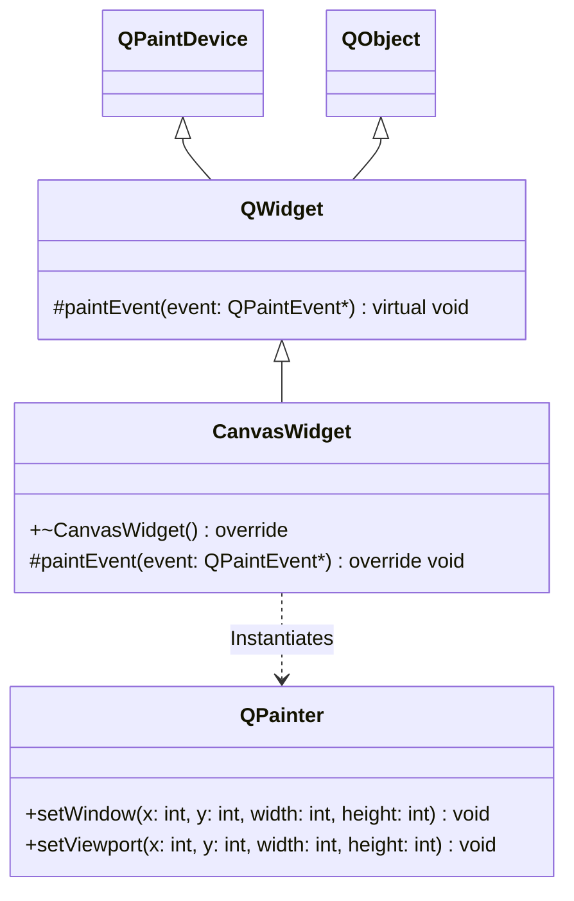
```mermaid
classDiagram
    QPaintDevice <|-- QWidget
    QObject <|-- QWidget
    QWidget <|-- CanvasWidget
    
    class QWidget {
        #paintEvent(event: QPaintEvent*) virtual void
    }
    
    class CanvasWidget {
        +~CanvasWidget() override
        #paintEvent(event: QPaintEvent*) override void
    }
    
    class QPainter {
        +setWindow(x: int, y: int, width: int, height: int) void
        +setViewport(x: int, y: int, width: int, height: int) void
    }
    
    CanvasWidget ..> QPainter : Instantiates
```

 

---

## qPainter_021
- [qPainter_021](../qPainter_021)
- **Brief**: Introduction to Polar Coordinates and trigonometric circular drawing.

**Topics:**
- Implementing a `polarToCartesian` mathematical helper function.
- Plotting shapes on exact orbits (radar UI design).
- Embedded hardware considerations regarding floating-point math overhead.

**Key Takeaway: Polar Coordinates**
- A Cartesian system plots points using a grid of `x` (left/right) and `y` (up/down).
- A Polar system plots points using purely `radius` (distance from center) and `angle`.
- Using `x = radius * cos(angle)` and `y = radius * sin(angle)` allows for perfectly plotting points in a circle (e.g., clock faces, radar screens).

```mermaid
classDiagram
    QPaintDevice <|-- QWidget
    QObject <|-- QWidget
    QWidget <|-- CanvasWidget
    
    class QWidget {
        #paintEvent(event: QPaintEvent*) virtual void
    }
    
    class CanvasWidget {
        +~CanvasWidget() override
        #paintEvent(event: QPaintEvent*) override void
        -polarToCartesian(radius: qreal, angleDegrees: qreal) const QPointF
    }
    
    class QPainter {
        +drawEllipse(center: QPointF, rx: qreal, ry: qreal) void
    }
    
    CanvasWidget ..> QPainter : Instantiates
```

---

## qPainter_022
- [qPainter_022](../qPainter_022)
- **Brief**: Introduction to `QPainterPath` and unified vector geometry construction.

**Topics:**
- Building straight-line paths using `moveTo()` and `lineTo()`.
- Closing paths automatically using `closeSubpath()`.
- The advantages of `QPainterPath` over primitive drawing functions.
- Rendering unified paths with `drawPath()`.

**Key Takeaway: The Unified Geometry Magic**
- If you draw a triangle using three separate `drawLine()` calls, Qt treats them as three independent sticks. They won't join cleanly at the corners, and you cannot easily fill the space between them.
- By using a `QPainterPath`, Qt treats the entire collection of lines as a **single, solid piece of geometry**. It perfectly joins the corners, allows you to fill the shape with a brush, and accurately punches out intersecting geometry (like the circle inside the triangle) using mathematical fill rules!

```mermaid
classDiagram
    QPaintDevice <|-- QWidget
    QObject <|-- QWidget
    QWidget <|-- CanvasWidget
    
    class QWidget {
        #paintEvent(event: QPaintEvent*) virtual void
    }
    
    class CanvasWidget {
        +~CanvasWidget() override
        #paintEvent(event: QPaintEvent*) override void
    }
    
    class QPainterPath {
        +moveTo(x: int, y: int) void
        +lineTo(x: int, y: int) void
        +closeSubpath() void
        +addEllipse(x: int, y: int, width: int, height: int) void
    }
    
    class QPainter {
        +drawPath(path: QPainterPath) void
    }
    
    CanvasWidget ..> QPainter : Instantiates
    CanvasWidget ..> QPainterPath : Instantiates
```

   

---

## qPainter_023
- [qPainter_023](../qPainter_023)
- **Brief**: Introduction to Bézier Curves and mathematical curve interpolation.

**Topics:**
- Drawing Quadratic Bézier Curves using `quadTo()`.
- Drawing Cubic Bézier Curves using `cubicTo()`.
- Visualizing control points using `drawPoint()`.
- The mathematical derivation of Bézier curves using De Casteljau's algorithm (Linear Interpolation).

**Key Takeaway: Bézier Curves and De Casteljau's Algorithm**
- A Bézier curve is an interpolation algorithm that allows smooth curves to be drawn without storing infinite points. 
- A **Quadratic** curve (`quadTo`) uses 1 control point. It creates a parabola.
- A **Cubic** curve (`cubicTo`) uses 2 control points. It can create an "S" shape (inflection point).

### Mathematical Derivation:

Bézier curves are built upon **Linear Interpolation** (the mathematical process of estimating a value somewhere between two known points). In this case, we use a time parameter `t` (from 0.0 to 1.0) to calculate the exact position of a point moving along a straight line between two static anchors.
$Linear(t) = (1 - t)A + tB$

To derive the **Quadratic** formula using three anchor points ($P_0, P_1, P_2$):
1. Interpolate along the straight lines connecting the anchors to create two dynamically moving dots: 
   - $A(t) = (1-t)P_0 + tP_1$ (moving between $P_0$ and $P_1$)
   - $B(t) = (1-t)P_1 + tP_2$ (moving between $P_1$ and $P_2$)
2. Interpolate those two linear points into the final **quadratic** point: $$Q(t) = (1-t)A(t) + tB(t)$$
3. Substitute A and B: $$Q(t) = (1-t)[(1-t)P_0 + tP_1] + t[(1-t)P_1 + tP_2]$$
4. Distribute: $$Q(t) = (1-t)^2 P_0 + t(1-t)P_1 + t(1-t)P_1 + t^2 P_2$$
5. Expand and combine: $$Q(t) = (1-t)^2 P_0 + 2(1-t)t P_1 + t^2 P_2$$

To derive the **Cubic** formula using four anchor points ($P_0, P_1, P_2, P_3$):
1. Interpolate along the straight lines connecting the anchors to create three dynamically moving dots: 
   - $A(t) = (1-t)P_0 + tP_1$ (moving between $P_0$ and $P_1$)
   - $B(t) = (1-t)P_1 + tP_2$ (moving between $P_1$ and $P_2$)
   - $C(t) = (1-t)P_2 + tP_3$ (moving between $P_2$ and $P_3$)
2. Interpolate those three points into two **quadratic** points: $$Q_1(t) = (1-t)A(t) + tB(t)$$ and $$Q_2(t) = (1-t)B(t) + tC(t)$$
3. Interpolate those two quadratic points into the final **cubic** point: $$Cubic(t) = (1-t)Q_1(t) + tQ_2(t)$$
4. Substitute $Q_1$ and $Q_2$: $$Cubic(t) = (1-t)[(1-t)A(t) + tB(t)] + t[(1-t)B(t) + tC(t)]$$
5. Distribute: $$Cubic(t) = (1-t)^2 A(t) + 2(1-t)t B(t) + t^2 C(t)$$
6. Substitute A, B, and C: $$Cubic(t) = (1-t)^2 [(1-t)P_0 + tP_1] + 2(1-t)t [(1-t)P_1 + tP_2] + t^2 [(1-t)P_2 + tP_3]$$
7. Expand and combine: $$Cubic(t) = (1-t)^3 P_0 + 3(1-t)^2 t P_1 + 3(1-t)t^2 P_2 + t^3 P_3$$

```mermaid
classDiagram
    QPaintDevice <|-- QWidget
    QObject <|-- QWidget
    QWidget <|-- CanvasWidget
    
    class QWidget {
        #paintEvent(event: QPaintEvent*) virtual void
    }
    
    class CanvasWidget {
        +~CanvasWidget() override
        #paintEvent(event: QPaintEvent*) override void
    }
    
    class QPainterPath {
        +moveTo(x: int, y: int) void
        +quadTo(ctrlX: int, ctrlY: int, endX: int, endY: int) void
        +cubicTo(ctrl1X: int, ctrl1Y: int, ctrl2X: int, ctrl2Y: int, endX: int, endY: int) void
    }
    
    class QPainter {
        +drawPath(path: QPainterPath) void
        +drawPoint(x: int, y: int) void
    }
    
    CanvasWidget ..> QPainter : Instantiates
    CanvasWidget ..> QPainterPath : Instantiates
```

 

---

## qPainter_024
- [qPainter_024](../qPainter_024)
- **Brief**: Differentiating between rendering the outline, the fill, or both for a given `QPainterPath`.

**Topics:**
- Drawing both the stroke and fill simultaneously using `drawPath()`.
- Drawing only the outline using `strokePath()`.
- Drawing only the interior using `fillPath()`.

**Key Takeaway: Reusable Geometry**
- A `QPainterPath` is pure, mathematical geometry. It has no color, no thickness, and no appearance until you instruct `QPainter` to render it.
- This allows for extreme UI flexibility: you can construct a complex shape (like a custom tab or button) once in memory, and then render it differently using `strokePath()` or `fillPath()` depending on its state (e.g., hovered, clicked, disabled) without having to recalculate the geometry.

```mermaid
classDiagram
    QPaintDevice <|-- QWidget
    QObject <|-- QWidget
    QWidget <|-- CanvasWidget
    
    class QWidget {
        #paintEvent(event: QPaintEvent*) virtual void
    }
    
    class CanvasWidget {
        +~CanvasWidget() override
        #paintEvent(event: QPaintEvent*) override void
    }
    
    class QPainterPath {
        +moveTo(x: int, y: int) void
        +lineTo(x: int, y: int) void
        +closeSubpath() void
    }
    
    class QPainter {
        +pen() QPen const
        +brush() QBrush const
        +drawPath(path: QPainterPath) void
        +strokePath(path: QPainterPath, pen: QPen) void
        +fillPath(path: QPainterPath, brush: QBrush) void
    }
    
    CanvasWidget ..> QPainter : Instantiates
    CanvasWidget ..> QPainterPath : Instantiates
```

  

---

## qPainter_025
- [qPainter_025](../qPainter_025)
- **Brief**: Understanding Qt's Fill Rules for determining the "inside" of complex, self-intersecting paths.

**Topics:**
- Testing `Qt::OddEvenFill` (the default rule).
- Testing `Qt::WindingFill` (the non-zero winding rule).
- Creating complex hole-punched geometries.

**Key Takeaway: Ray-Casting & Path Winding**
- **OddEvenFill** acts like a laser beam. It shoots a ray from a given point and counts how many path boundaries it crosses. If it crosses an odd number, the area is "inside" and gets painted. If it crosses an even number, it's a hole. It ignores the direction the path was drawn.
- **WindingFill** counts directional loops. If you draw a shape clockwise, it adds +1 to the area. If you draw counter-clockwise, it subtracts -1. If the sum is `0`, the area is a hole. If the sum is anything else, it gets painted. This makes drawing direction extremely critical for creating donuts or hollow compound shapes.

```mermaid
classDiagram
    QPaintDevice <|-- QWidget
    QObject <|-- QWidget
    QWidget <|-- CanvasWidget
    
    class QWidget {
        #paintEvent(event: QPaintEvent*) virtual void
    }
    
    class CanvasWidget {
        +~CanvasWidget() override
        #paintEvent(event: QPaintEvent*) override void
    }
    
    class QPainterPath {
        +setFillRule(rule: Qt::FillRule) void
    }
    
    class QPainter {
        +drawPath(path: QPainterPath) void
    }
    
    CanvasWidget ..> QPainter : Instantiates
    CanvasWidget ..> QPainterPath : Instantiates
```

---

## qPainter_026
- [qPainter_026](../qPainter_026)
- **Brief**: Converting zero-thickness mathematical paths into solid, fillable geometry using `QPainterPathStroker`.

**Topics:**
- Configuring stroke width, cap styles, and join styles on a stroker.
- Understanding `setCurveThreshold` for controlling the precision of generated outlines.
- Using `createStroke()` to generate a new `QPainterPath`.
- Filling generated outlines with gradients.

**Key Takeaway: Expanding Geometry**
- `QPainterPathStroker` is a geometry generation tool. It takes an input path and physically constructs a new path representing the outline of the original.
- This is extremely powerful because standard pens (`QPen`) have limitations (like applying complex gradients to the stroke). By converting the stroke into a fillable shape, you can apply any brush, use it for hit-testing, or merge it with other shapes using boolean operations.

```mermaid
classDiagram
    QPaintDevice <|-- QWidget
    QObject <|-- QWidget
    QWidget <|-- CanvasWidget
    
    class QWidget {
        #paintEvent(event: QPaintEvent*) virtual void
    }
    
    class CanvasWidget {
        +~CanvasWidget() override
        #paintEvent(event: QPaintEvent*) override void
    }
    
    class QPainterPathStroker {
        +setWidth(width: qreal) void
        +setCapStyle(style: Qt::PenCapStyle) void
        +setCurveThreshold(threshold: qreal) void
        +createStroke(path: QPainterPath) QPainterPath
    }
    
    class QPainterPath {
        +moveTo(x: int, y: int) void
        +cubicTo(ctrl1X: int, ctrl1Y: int, ctrl2X: int, ctrl2Y: int, endX: int, endY: int) void
    }
    
    class QPainter {
        +drawPath(path: QPainterPath) void
    }
    
    CanvasWidget ..> QPainter : Instantiates
    CanvasWidget ..> QPainterPath : Instantiates
    CanvasWidget ..> QPainterPathStroker : Instantiates
```

  

---

## qPainter_027
- [qPainter_027](../qPainter_027)
- **Brief**: Performing vector calculations on a `QPainterPath` to dynamically place and align objects (like arrowheads) along curves.

**Topics:**
- Finding a specific coordinate on a bezier curve using `pointAtPercent()`.
- Calculating the tangent vector (angle) of a bezier curve at a specific point using `angleAtPercent()`.
- Using translations and rotations to align sub-shapes perfectly with the flow of a master shape.

**Key Takeaway: Analytical Paths**
- A `QPainterPath` is not just a drawing instruction; it is an analytical geometry object. You can query it for lengths, intersections, points, and tangents.
- `angleAtPercent(t)` returns the standard mathematical angle (counter-clockwise). Because `QPainter::rotate()` expects clockwise degrees, you must negate the angle (`-angle`) to align your coordinate system with the tangent vector of the curve!

```mermaid
classDiagram
    QPaintDevice <|-- QWidget
    QObject <|-- QWidget
    QWidget <|-- CanvasWidget
    
    class QWidget {
        #paintEvent(event: QPaintEvent*) virtual void
    }
    
    class CanvasWidget {
        +~CanvasWidget() override
        #paintEvent(event: QPaintEvent*) override void
    }
    
    class QPainterPath {
        +pointAtPercent(t: qreal) QPointF const
        +angleAtPercent(t: qreal) qreal const
    }
    
    class QPainter {
        +drawPath(path: QPainterPath) void
        +rotate(a: qreal) void
        +translate(offset: QPointF) void
    }
    
    CanvasWidget ..> QPainter : Instantiates
    CanvasWidget ..> QPainterPath : Instantiates
```

 

---

## qPainter_028
- [qPainter_028](../qPainter_028)
- **Brief**: Understanding typography metrics and accurately measuring text bounds using `QFontMetricsF`.

**Topics:**
- Measuring text analytically before drawing.
- Defining a `QFont` and assigning it to `QPainter`.
- Using `QFontMetricsF::boundingRect()` to capture logical bounding boxes.
- Using `QFontMetricsF::tightBoundingRect()` to capture exact ink bounding boxes.
- Visualizing baseline origins.

**Key Takeaway: Analytical Typography**
- `QFontMetricsF` is incredibly useful because it doesn't require a `QPainter` or an active paint event. You can use it in your UI logic to pre-calculate how much space a widget will need just based on its font and string contents.
- There is a crucial difference between the logical `boundingRect` (which includes font-designed whitespace padding) and the ink `tightBoundingRect` (which perfectly hugs the drawn pixels).
- The `boundingRect` it returns is tightly fitted. Because standard `drawText` uses `(0,0)` as the baseline origin (where the bottom of letters sit), the `boundingRect` will have negative `y` coordinates for ascenders (like 'H') and positive `y` coordinates for descenders (like 'p').

```mermaid
classDiagram
    QPaintDevice <|-- QWidget
    QObject <|-- QWidget
    QWidget <|-- CanvasWidget
    
    class QWidget {
        #paintEvent(event: QPaintEvent*) virtual void
    }
    
    class CanvasWidget {
        +~CanvasWidget() override
        #paintEvent(event: QPaintEvent*) override void
    }
    
    class QFontMetricsF {
        +boundingRect(text: QString) QRectF const
        +tightBoundingRect(text: QString) QRectF const
    }
    
    class QPainter {
        +setFont(font: QFont) void
        +drawText(x: int, y: int, text: QString) void
    }
    
    CanvasWidget ..> QPainter : Instantiates
    CanvasWidget ..> QFontMetricsF : Instantiates
```

 

---

## qPainter_029
- [qPainter_029](../qPainter_029)
- **Brief**: Measuring text with layout constraints (like word wrapping) using `QPainter::boundingRect()`.

**Topics:**
- Establishing a constraint `QRectF` column for text to flow inside.
- Combining alignment and word-wrap flags using bitwise OR (`Qt::TextWordWrap | Qt::AlignTop | Qt::AlignLeft`).
- Calculating the resulting bounding box via `QPainter::boundingRect()` that simulates these constraints without drawing.
- Using `QPainter::drawText()` with the exact same constraint box and flags to perfectly match the calculated measurement.

**Key Takeaway: Constrained Layouts**
- Unlike `QFontMetrics` which evaluates a raw string linearly, `QPainter::boundingRect(constraintBox, flags, text)` applies UI layout logic. It wraps words, aligns text, and returns the actual height and width consumed within your constraints. This is critical for drawing multi-line text dynamically!

```mermaid
classDiagram
    QPaintDevice <|-- QWidget
    QObject <|-- QWidget
    QWidget <|-- CanvasWidget
    
    class QWidget {
        #paintEvent(event: QPaintEvent*) virtual void
    }
    
    class CanvasWidget {
        +~CanvasWidget() override
        #paintEvent(event: QPaintEvent*) override void
    }
    
    class QPainter {
        +boundingRect(rectangle: QRectF, flags: int, text: QString) QRectF
        +drawText(rectangle: QRectF, flags: int, text: QString, boundingRect: QRectF*) void
    }
    
    CanvasWidget ..> QPainter : Instantiates
```

---

## qPainter_030
- [qPainter_030](../qPainter_030)
- **Brief**: Building geometric anchor points on nodes to automatically position multi-line text labels.

**Topics:**
- Extracting geometric edge coordinates from a `QRectF` using `top()`, `bottom()`, `left()`, `right()`, and `center()`.
- Combining coordinates to build North, South, East, and West anchor `QPointF` structures.
- Utilizing C++ lambdas (`[&]`) to cleanly execute repetitive drawing tasks within `paintEvent`.
- Dynamically offsetting text `QRectF` bounds so they correctly attach to anchor points without overlapping the parent node.

**Key Takeaway: Anchor Offsets**
- By measuring text with `QPainter::boundingRect()` first, you obtain the exact height and width of the label. You can then use `QRectF::moveTop()`, `moveBottom()`, `moveLeft()`, and `moveRight()` to cleanly align the label's bounding box against the node's anchor point, ensuring the text pushes outward away from the node instead of drawing over it.

```mermaid
classDiagram
    QPaintDevice <|-- QWidget
    QObject <|-- QWidget
    QWidget <|-- CanvasWidget
    
    class QWidget {
        #paintEvent(event: QPaintEvent*) virtual void
    }
    
    class CanvasWidget {
        +~CanvasWidget() override
        #paintEvent(event: QPaintEvent*) override void
    }
    
    class QPainter {
        +boundingRect(rectangle: QRectF, flags: int, text: QString) QRectF
        +drawText(rectangle: QRectF, flags: int, text: QString, boundingRect: QRectF*) void
        +fillRect(rectangle: QRectF, color: QColor) void
    }
    
    CanvasWidget ..> QPainter : Instantiates
```

---

## qPainter_031
- [qPainter_031](../qPainter_031)
- **Brief**: Restricting rendering areas using `QPainterPath` clipping.

**Topics:**
- Creating a `QPainterPath` (like a circle) to act as a clipping region.
- Querying clipping state using `hasClipping()`.
- Applying clipping using `setClipPath()`.
- Temporarily disabling and re-enabling clipping with `setClipping(bool)`.

**Key Takeaway: Hard Geometry Cuts**
- Clipping is incredibly powerful. Once a clip path is set, any drawing operations (even complex shapes, thick lines, or large background fills) are cleanly sliced off at the exact boundary of the clip path. This allows for effects like rounded avatars, magnifying glasses, or complex scroll view bounds without manually calculating intersections!

```mermaid
classDiagram
    QPaintDevice <|-- QWidget
    QObject <|-- QWidget
    QWidget <|-- CanvasWidget
    
    class QWidget {
        #paintEvent(event: QPaintEvent*) virtual void
    }
    
    class CanvasWidget {
        +~CanvasWidget() override
        #paintEvent(event: QPaintEvent*) override void
    }
    
    class QPainter {
        +hasClipping() bool const
        +setClipPath(path: QPainterPath) void
        +setClipping(enable: bool) void
    }
    
    class QPainterPath {
        +addEllipse(rectangle: QRectF) void
    }
    
    CanvasWidget ..> QPainter : Instantiates
    CanvasWidget ..> QPainterPath : Instantiates
```

   

---

## qPainter_032
- [qPainter_032](../qPainter_032)
- **Brief**: Applying Porter-Duff compositing rules to blend overlapping pixels.

**Topics:**
- Demonstrating the default blending mode (`CompositionMode_SourceOver`).
- Replacing destination pixels entirely with source pixels using `CompositionMode_Source`.
- Utilizing `CompositionMode_Clear` to act as an eraser, completely wiping out pixels to reveal a translucent widget background.
- Understanding the difference between Source (the new drawing) and Destination (the pixels already present on the canvas).

**Key Takeaway: Porter-Duff Erasers**
- Setting the composition mode to `QPainter::CompositionMode_Clear` is incredibly useful for UI tasks where you need to "punch a hole" through a solid background (for instance, creating a dimming overlay with a clear spotlight in the middle to highlight a tutorial element).

```mermaid
classDiagram
    QPaintDevice <|-- QWidget
    QObject <|-- QWidget
    QWidget <|-- CanvasWidget
    
    class QWidget {
        +resize(w: int, h: int) void
        +setAttribute(attribute: Qt::WidgetAttribute, on: bool = true) void
        #paintEvent(event: QPaintEvent*) virtual void
    }
    
    class CanvasWidget {
        +~CanvasWidget() override
        #paintEvent(event: QPaintEvent*) override void
    }
    
    class QPainter {
        +setCompositionMode(mode: CompositionMode) void
    }
    
    CanvasWidget ..> QPainter : Instantiates
```

---

## qPainter_033
- [qPainter_033](../qPainter_033)
- **Brief**: Drawing raster images and pixmaps, and exploring tiling.

**Topics:**
- Generating a pixel-perfect checkerboard pattern dynamically using `QImage` and `setPixelColor()`.
- Converting a `QImage` into a `QPixmap` for hardware-accelerated rendering.
- Drawing images using `QPainter::drawImage()` and `QPainter::drawPixmap()`.
- Efficiently repeating a texture to fill a massive background area using `QPainter::drawTiledPixmap()`.

**Key Takeaway: Image vs Pixmap**
- `QImage` is optimized for I/O and direct pixel manipulation on the CPU. `QPixmap` is optimized for displaying on the screen (often via GPU). For static UI assets, always convert to `QPixmap` and use `drawPixmap()` or `drawTiledPixmap()` for maximum performance.

```mermaid
classDiagram
    QPaintDevice <|-- QWidget
    QObject <|-- QWidget
    QWidget <|-- CanvasWidget
    
    class QWidget {
        +resize(w: int, h: int) void
        #paintEvent(event: QPaintEvent*) virtual void
    }
    
    class CanvasWidget {
        +~CanvasWidget() override
        #paintEvent(event: QPaintEvent*) override void
    }
    
    class QPainter {
        +drawImage(x: int, y: int, image: QImage) void
        +drawPixmap(x: int, y: int, pixmap: QPixmap) void
        +drawTiledPixmap(x: int, y: int, width: int, height: int, pixmap: QPixmap) void
    }
    
    class QImage {
        +setPixelColor(x: int, y: int, color: QColor) void
    }
    
    class QPixmap {
        +fromImage(image: QImage)$ QPixmap
    }
    
    CanvasWidget ..> QPainter : Instantiates
    CanvasWidget ..> QImage : Instantiates
    CanvasWidget ..> QPixmap : Instantiates
```

  

---

## qPainter_034
- [qPainter_034](../qPainter_034)
- **Brief**: Managing high-resolution drawing on high-DPI displays by manipulating `devicePixelRatio`.

**Topics:**
- Creating and filling a `QPixmap` programmatically.
- Rendering an image using the default `1.0` pixel ratio where 1 physical pixel maps to 1 logical screen coordinate.
- Handling "Retina" or high-density graphics by manually scaling the ratio via `QPixmap::setDevicePixelRatio()`.
- Understanding how Qt automatically compresses a high-resolution pixmap into a smaller logical area on-screen to preserve crispness.

**Key Takeaway: The Mathematics of Device Pixel Ratio**
- The "Device Pixel Ratio" represents the **linear scale factor** (1D dimension) of an image or screen. 
- A ratio of `2.0` (like Apple's Retina display standard) means that a single logical pixel coordinate on the screen is rendered using 2 physical pixels on the X-axis and 2 physical pixels on the Y-axis.
- Since pixels are 2D squares on a grid, a `2.0` linear ratio maps a **2x2 grid of physical pixels** into **1 logical pixel**. 
- Mathematically, this means there are exactly **4 physical pixels for every 1 logical pixel**. 
- However, industry phrasing (such as iOS `@2x` assets) usually defaults to describing the 1D scale. Therefore, you will frequently hear developers describe this as *"2 physical pixels for every 1 logical pixel,"* referring strictly to the linear ratio, even though the area contains 4.

```mermaid
classDiagram
    QPaintDevice <|-- QWidget
    QObject <|-- QWidget
    QWidget <|-- CanvasWidget
    
    class QWidget {
        +resize(w: int, h: int) void
        #paintEvent(event: QPaintEvent*) virtual void
    }
    
    class CanvasWidget {
        +~CanvasWidget() override
        #paintEvent(event: QPaintEvent*) override void
    }
    
    class QPainter {
        +drawPixmap(x: int, y: int, pixmap: QPixmap) void
    }
    
    class QPixmap {
        +fill(color: QColor) void
        +setDevicePixelRatio(scaleFactor: qreal) void
    }
    
    CanvasWidget ..> QPainter : Instantiates
    CanvasWidget ..> QPixmap : Instantiates
```

 

---

## qPainter_035
- [qPainter_035](../qPainter_035)
- **Brief**: Serializing and replaying drawing commands using `QPicture`.

**Topics:**
- Creating a `QPicture` to act as an invisible recording canvas.
- Using a `QPainter` to serialize drawing commands into the `QPicture` rather than rendering them to a screen.
- Saving the recorded vector commands to a highly compressed, proprietary binary Qt format file (`.pic`).
- Loading the `QPicture` binary file from disk and executing the instructions onto a physical canvas using `QPainter::drawPicture()`.
- Understanding the internal structure of `QPicture` files by inspecting them with a hex editor.

**Key Takeaway: Vector Serialization**
- `QPicture` does not save pixel data like a PNG or JPG. It saves the actual sequence of vector instructions (e.g. `drawEllipse`, `setPen`). This makes `.pic` files incredibly small, and it allows them to be scaled infinitely without any loss of quality when replayed!

```mermaid
classDiagram
    QPaintDevice <|-- QWidget
    QPaintDevice <|-- QPicture
    QObject <|-- QWidget
    QWidget <|-- CanvasWidget
    
    class QWidget {
        +resize(w: int, h: int) void
        #paintEvent(event: QPaintEvent*) virtual void
    }
    
    class CanvasWidget {
        +~CanvasWidget() override
        #paintEvent(event: QPaintEvent*) override void
    }
    
    class QPainter {
        +begin(device: QPaintDevice*) bool
        +end() bool
        +drawPicture(x: int, y: int, picture: QPicture) void
    }
    
    class QPicture {
        +save(fileName: QString) bool
        +load(fileName: QString) bool
        +boundingRect() QRect
    }
    
    CanvasWidget ..> QPainter : Instantiates
    CanvasWidget ..> QPicture : Instantiates
```

   

---

## qPainter_036
- [qPainter_036](../qPainter_036)
- **Brief**: Managing interpolation algorithms when scaling images using `SmoothPixmapTransform`.

**Topics:**
- Creating a tiny 10x10 piece of pixel art using `QImage`.
- Scaling a `QPixmap` up massively when drawing it.
- Demonstrating the default interpolation method (Nearest-Neighbor), which perfectly preserves sharp, blocky pixel edges.
- Enabling the `QPainter::SmoothPixmapTransform` render hint to switch to Bilinear interpolation, which creates a smooth, blurred result.

**Key Takeaway: Interpolation Matters**
- Whenever you scale an image, the renderer must guess what pixels to insert. Use the default (Nearest-Neighbor) for pixel-art, barcodes, and sharp graphics. Use `SmoothPixmapTransform` (Bilinear) for photographs or realistic textures where harsh square pixels would look ugly.

```mermaid
classDiagram
    QPaintDevice <|-- QWidget
    QObject <|-- QWidget
    QWidget <|-- CanvasWidget
    
    class QWidget {
        +resize(w: int, h: int) void
        #paintEvent(event: QPaintEvent*) virtual void
    }
    
    class CanvasWidget {
        +~CanvasWidget() override
        #paintEvent(event: QPaintEvent*) override void
    }
    
    class QPainter {
        +setRenderHint(hint: RenderHint, on: bool) void
        +drawPixmap(x: int, y: int, w: int, h: int, pixmap: QPixmap) void
    }
    
    class QImage {
        +setPixelColor(x: int, y: int, color: QColor) void
    }
    
    class QPixmap {
        +fromImage(image: QImage)$ QPixmap
    }
    
    CanvasWidget ..> QPainter : Instantiates
    CanvasWidget ..> QImage : Instantiates
    CanvasWidget ..> QPixmap : Instantiates
```

---

## qPainter_037
- [qPainter_037](../qPainter_037)
- **Brief**: Inspecting the active state of the `QPainter` rendering engine using `renderHints()`.

**Topics:**
- Querying the active flags of the rendering engine at runtime.
- Understanding how to test the `QPainter::RenderHints` bitmask using `testFlag()`.
- Uncovering hidden default behaviors (e.g., `QPainter::TextAntialiasing` is enabled by default to protect text readability, whereas standard `QPainter::Antialiasing` for shapes is disabled by default).

**Key Takeaway: Independent Hinting Flags**
- Toggling a master state like `QPainter::Antialiasing` does NOT toggle `QPainter::TextAntialiasing`. They are completely independent rendering flags that target different aspects of the pipeline.

```mermaid
classDiagram
    QPaintDevice <|-- QWidget
    QObject <|-- QWidget
    QWidget <|-- CanvasWidget
    
    class QWidget {
        +resize(w: int, h: int) void
        #paintEvent(event: QPaintEvent*) virtual void
    }
    
    class CanvasWidget {
        +~CanvasWidget() override
        #paintEvent(event: QPaintEvent*) override void
    }
    
    class QPainter {
        +renderHints() RenderHints
        +testRenderHint(hint: RenderHint) bool
        +setRenderHint(hint: RenderHint, on: bool) void
    }
    
    CanvasWidget ..> QPainter : Instantiates
```

 

---

## qPainter_038
- [qPainter_038](../qPainter_038)
- **Brief**: Stress-testing CPU raster performance and comparing standard vs. premultiplied alpha formats.

**Topics:**
- Drawing 10,000 semi-transparent ellipses to benchmark the Raster engine CPU performance.
- Using `QElapsedTimer` to calculate execution time in milliseconds.
- Discovering the massive performance optimizations of `QImage::Format_ARGB32_Premultiplied` (where alpha math is pre-calculated) over standard `QImage::Format_ARGB32`.
- Understanding how to enable GPU hardware acceleration by promoting a `QWidget` base class to a `QOpenGLWidget`.

**Key Takeaway: Alpha Blending is Expensive**
- Alpha blending requires the CPU to do math on every single pixel it overlaps. Using `Format_ARGB32_Premultiplied` can literally double your rendering speed when drawing heavy transparencies on the CPU. If you need even more speed, swap to `QOpenGLWidget` to push the instructions to the GPU.

```mermaid
classDiagram
    QPaintDevice <|-- QWidget
    QPaintDevice <|-- QImage
    QObject <|-- QWidget
    QWidget <|-- CanvasWidget
    QWidget <|-- QOpenGLWidget
    
    class QWidget {
        +resize(w: int, h: int) void
        #paintEvent(event: QPaintEvent*) virtual void
    }
    
    class QOpenGLWidget {
        +initializeGL() virtual void
        +paintGL() virtual void
    }
    
    class CanvasWidget {
        +~CanvasWidget() override
        #paintEvent(event: QPaintEvent*) override void
    }
    
    class QPainter {
        +drawEllipse(x: int, y: int, w: int, h: int) void
        +drawImage(x: int, y: int, image: QImage) void
    }
    
    class QImage {
        +fill(color: QColor) void
    }
    
    CanvasWidget ..> QPainter : Instantiates
    CanvasWidget ..> QImage : Instantiates
    CanvasWidget ..> QOpenGLWidget : Can Inherit From (for GPU)
```

 

---

## qPainter_039
- [qPainter_039](../qPainter_039)
- **Brief**: Serializing drawing commands into an infinitely scalable SVG file using `QSvgGenerator`.

**Topics:**
- Linking against the `Qt6::Svg` module in CMake.
- Creating a decoupled drawing function (`drawMyArt()`) that can target both a `QWidget` screen and a `QSvgGenerator` file simultaneously.
- Setting physical properties of the generated file using `QSvgGenerator::setSize()`.
- Understanding why `QSvgGenerator::setViewBox()` is critical to ensure the generated SVG document scales correctly in web browsers without cropping.

**Key Takeaway: The Power of ViewBox**
- Standard images rely on fixed pixels. SVGs rely on a mathematical `viewBox`. By explicitly defining the coordinate space of your drawing area with `setViewBox`, you guarantee that any SVG renderer (browsers, Illustrator) can mathematically scale your graphic to any window size perfectly.

```mermaid
classDiagram
    QPaintDevice <|-- QWidget
    QPaintDevice <|-- QSvgGenerator
    QObject <|-- QWidget
    QWidget <|-- CanvasWidget
    
    class CanvasWidget {
        +~CanvasWidget() override
        #paintEvent(event: QPaintEvent*) override void
        -exportToSvg() void
    }
    
    class QPainter {
        +begin(device: QPaintDevice*) bool
        +end() bool
    }
    
    class QSvgGenerator {
        +setFileName(fileName: QString) void
        +setSize(size: QSize) void
        +setViewBox(viewBox: QRect) void
        +setTitle(title: QString) void
        +setDescription(description: QString) void
    }
    
    CanvasWidget ..> QPainter : Instantiates
    CanvasWidget ..> QSvgGenerator : Instantiates
    CanvasWidget ..> QPushButton : Instantiates
```

  

---

## qPainter_040
- [qPainter_040](../qPainter_040)
- **Brief**: Serializing drawing commands into a pixel-based PNG file by rendering to a `QImage`.

**Topics:**
- Allocating a raw memory buffer (`QImage::Format_ARGB32`) to act as a paint device.
- Initializing the pixel grid with a default background using `QImage::fill()`.
- Dumping the memory buffer to a compressed `.png` file using `QImage::save()`.

**Key Takeaway: Vector vs Raster Serialization**
- Unlike `QSvgGenerator` or `QPdfWriter` which stream mathematical vector commands directly to disk in real-time, PNG generation requires allocating the final pixel grid in memory first, drawing the pixels, and then running a compression pass (`save()`) to dump the memory to a file.

```mermaid
classDiagram
    QPaintDevice <|-- QWidget
    QPaintDevice <|-- QImage
    QObject <|-- QWidget
    QWidget <|-- CanvasWidget
    
    class CanvasWidget {
        +~CanvasWidget() override
        #paintEvent(event: QPaintEvent*) override void
        -exportToPng() void
    }
    
    class QPainter {
        +begin(device: QPaintDevice*) bool
        +end() bool
    }
    
    class QImage {
        +fill(color: Qt::GlobalColor) void
        +save(fileName: QString) bool
    }
    
    CanvasWidget ..> QPainter : Instantiates
    CanvasWidget ..> QImage : Instantiates
    CanvasWidget ..> QPushButton : Instantiates
```

  

---

## qPainter_041
- [qPainter_041](../qPainter_041)
- **Brief**: Generating high-resolution, multi-page print documents using `QPdfWriter`.

**Topics:**
- Exporting drawings to PDF by targeting a `QPdfWriter` paint device.
- Configuring physical print properties such as `QPageSize`, margins, and DPI resolution.
- Understanding the difference between logical pixels and physical print dots, and the critical distinction between setting `QFont` sizes in *points* vs *pixels*.
- Generating multi-page documents by explicitly calling `QPdfWriter::newPage()`.
- Applying `QPainter::scale()` to visually preview massive print coordinates on a low-resolution screen widget.

**Key Takeaway: DPI Scaling and Coordinate Space**
- Physical printers operate at much higher resolutions (e.g., 300 DPI) than computer monitors. When drawing to a PDF, your coordinate system scales up massively. If you rely on point-sized fonts (`setPointSize()`), the OS automatically scales them up to match the DPI, which can blow apart fixed-pixel layouts. Hardcoding pixel sizes (`setPixelSize()`) ensures the typography scales perfectly with your raw drawing coordinates.

```mermaid
classDiagram
    QPaintDevice <|-- QWidget
    QPaintDevice <|-- QPdfWriter
    QObject <|-- QWidget
    QWidget <|-- CanvasWidget
    
    class CanvasWidget {
        +~CanvasWidget() override
        #paintEvent(event: QPaintEvent*) override void
        -exportToPdf() void
    }
    
    class QPainter {
        +begin(device: QPaintDevice*) bool
        +end() bool
        +scale(sx: qreal, sy: qreal) void
    }
    
    class QPdfWriter {
        +setPageSize(size: QPageSize) void
        +setPageMargins(margins: QMarginsF, units: QPageLayout::Unit) void
        +setResolution(resolution: int) void
        +newPage() bool
    }
    
    CanvasWidget ..> QPainter : Instantiates
    CanvasWidget ..> QPdfWriter : Instantiates
    CanvasWidget ..> QPushButton : Instantiates
```

   